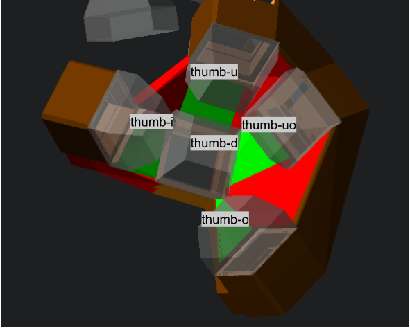
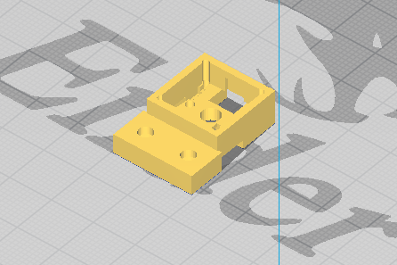
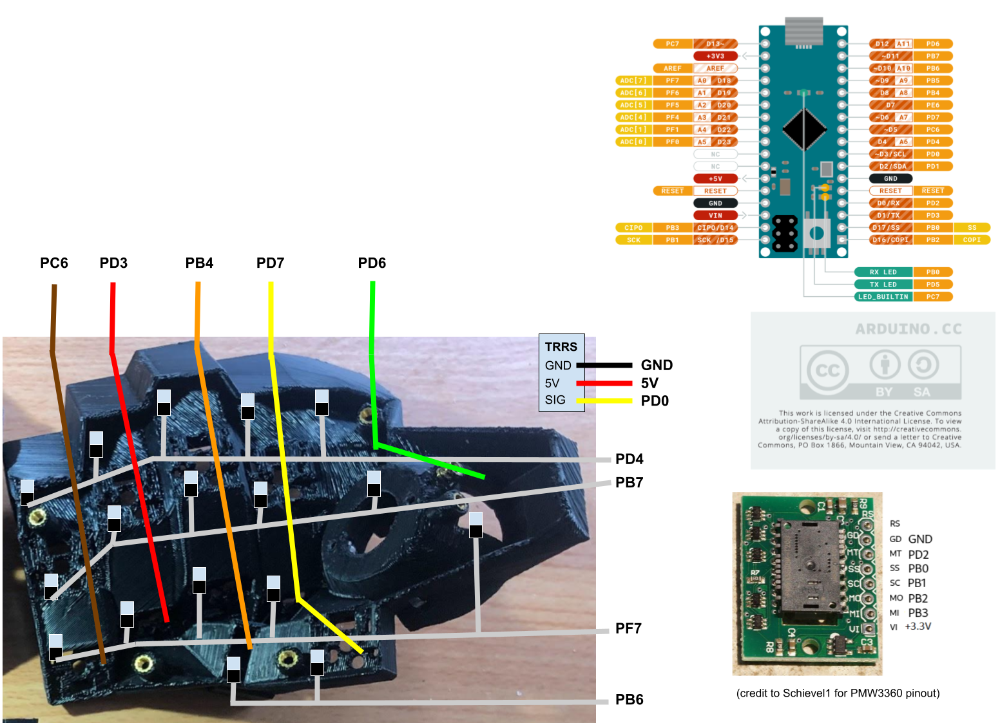
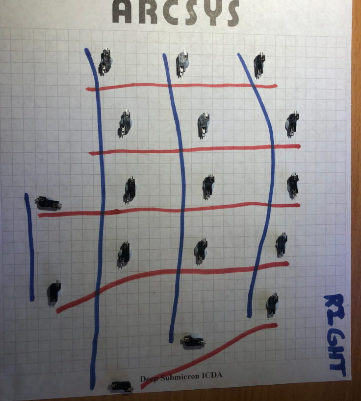
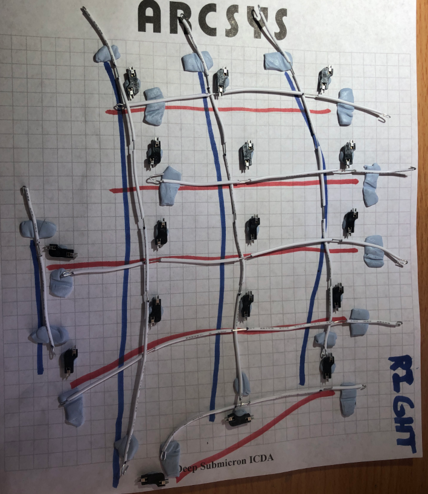
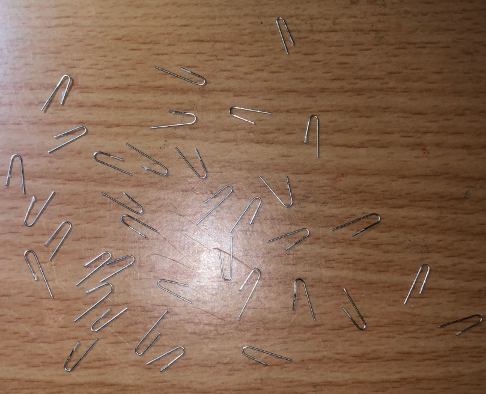
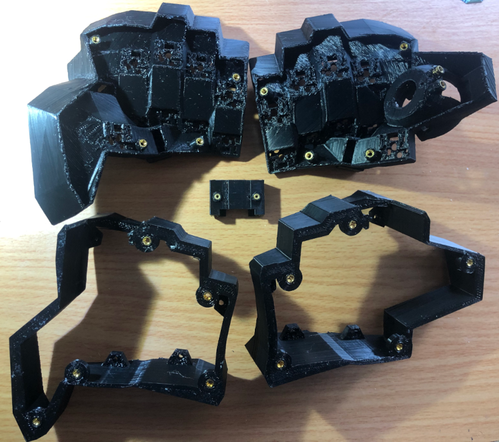
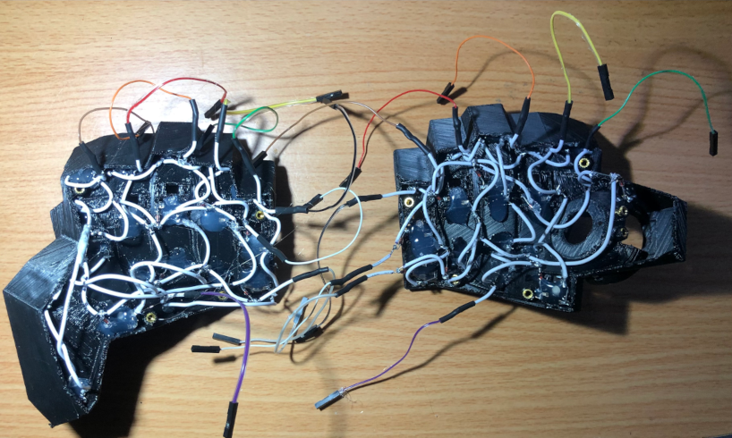
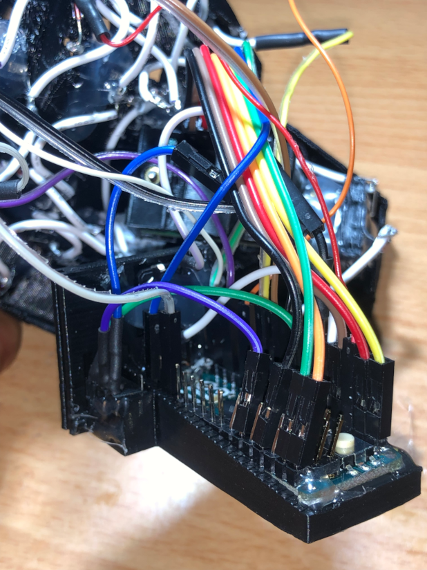
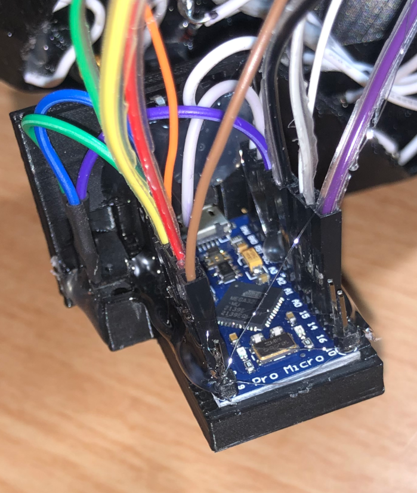

# Trackswitch Manuform -- A Hyper-Ergonomic Trackball-Enabled Dactyl with a Crazy Mouse Level Shift Mechanism

This keyboard is an attempt to make a best-of-both-worlds combination between the
modular (and support-saving) design of [dereknheiley's compactyl manuform](https://github.com/dereknheiley/compactyl) (with adjustable wrist rest mounts)
and the trackball-enabled design of the [noahprince22's tracktyl manuform](https://github.com/noahprince22/tractyl-manuform-keyboard),
forking the firmware from [Schievel1's dactyl_manuform_r_track](https://github.com/Schievel1/dactyl_manuform_r_track).

It also incorporates some novel features:
- Drawing inspiration from the vertical actuations of [JesusFreke's lalboard](https://github.com/JesusFreke/lalboard), the keys above and below the home row are positioned such that actuating them involves the continuation of a single motion (i.e. extending or curling the fingers) rather than two separate motions (extending then pressing down or curling then pressing down, as is the case with a conventional flat keyboard layout). Less muscle memory + shorter travel distance = quicker and more comfortable typing!
- I've yeeted keys that I find exceed a certain (low) threshold of difficulty to press on a standard ortholinear layout. These include the (QWERTY) `n` and `b` keys, as well as all the keys outwards from the pinky column.
- To make up for this lack of keys, the left side of this keyboard features a powerful thumb cluster with five keys (four of which are vertically actuated: one by the base of the thumb (actuated by curling the thumb inwards), two by the tip of the thumb (actuated by extending the thumb upwards), and another by the thumb knuckle (actuated by moving the thumb outwards)) that allow for fast level-shifting.
- The right side incorporates a trackball mount with a mechanism that allows the trackball to act as a "switch" that can be pressed down to both enable mouse movement and activate the mouse button layer. I refer to this collective assembly as the "trackswitch".
- Both the trackswitch and trackball sensor have fully parameterized mounts with mounting mechanisms that allow their distance from the trackball to be micro-adjustable.
- Fully parameterized case mounts for the arduino micro and pro-micro MCUs.

<!--

-->

# Build Guide

## Tools

- 3D printer (I use a modestly upgraded Ender 3)
- Raspberry Pi with [Octoprint](https://octoprint.org/) for remote printing (recommended)
- Soldering Iron with [M2, M3 insert tips](https://www.amazon.com/gp/product/B08B17VQLD/ref=ppx_yo_dt_b_search_asin_title?ie=UTF8&psc=1)
- Solder fume extractor
- Safety goggles
- Sharpie pen
- Multimeter with continuity beep and alligator clips
- Hot glue gun
- Heat gun and heat shrink tubing
- PTFE tape (also known as "plumbers' tape")
- Wire cutters
- Needle-nose pliers
- Caliper (digital recommended)
- Keyswitch/Keycap puller
- [0.6mm nozzle](https://www.amazon.com/gp/product/B093SKXHL3/ref=ppx_yo_dt_b_search_asin_title?ie=UTF8&th=1) (recommended for faster prints)
- [Blu-Tac](https://www.amazon.com/gp/product/B001FGLX72/ref=ppx_yo_dt_b_search_asin_title?ie=UTF8&psc=1)

## Bill-of-Materials

Part | Price | Comments
-----|-------|----
[Arduino micro with headers](https://www.amazon.com/gp/product/B00AFY2S56/ref=ppx_yo_dt_b_search_asin_title?ie=UTF8&th=1) | $23.88 | This is needed only for the right (trackball) half of the keyboard (you can get away with a pro micro on the left half).
[Pro Micro MCU](https://www.amazon.com/gp/product/B08THVMQ46/ref=ppx_yo_dt_b_search_asin_title?ie=UTF8&psc=1) | $19.88 | For the left half. BE CAREFUL WITH THESE! They're pretty flimsy and I've broken the USB headers on muliple of them, so it's good to get a few in case something happens.
[PMW3360 Motion Sensor](https://www.tindie.com/products/jkicklighter/pmw3360-motion-sensor/) | $29.99 | Trackball motion sensor.
[Key switches x35](https://www.amazon.com/gp/product/B07X3WKM54/ref=ppx_yo_dt_b_search_asin_title?ie=UTF8&psc=1) | $34.99 | If you're new to mechanical keyboards Gateron browns are probably a safe option.
[Keyswitch with a good amount of actuation force](https://www.amazon.com/gp/product/B078FMPZ8R/ref=ppx_yo_dt_b_search_asin_title?ie=UTF8&psc=1) | $20.99 | This is for the trackswitch -- some force is needed to push the trackball up, but too much force can make the motion less smooth; I recommend getting a sample pack like this one so that you have a few alternatives to try. In my case I ended up going with TODO.
[Trackball](https://www.aliexpress.us/item/3256803106743416.html?spm=a2g0o.productlist.main.7.559e75b6LrrWPq&algo_pvid=5b156845-75aa-4609-92bb-10b4919b35ad&algo_exp_id=5b156845-75aa-4609-92bb-10b4919b35ad-3&pdp_ext_f=%7B%22sku_id%22%3A%2212000025055404434%22%7D&pdp_npi=2%40dis%21USD%2123.46%2111.03%21%21%21%21%21%402102186a16738183211058438d0674%2112000025055404434%21sea&curPageLogUid=fiwnZejyx836) | $11.99
[Dowel Pins](https://www.amazon.com/gp/product/B07M63KXKS/ref=ppx_yo_dt_b_search_asin_title?ie=UTF8&psc=1) | $7.49
[Miniature Bearings](https://www.amazon.com/gp/product/B00ZHSQX42/ref=ppx_yo_dt_b_search_asin_title?ie=UTF8&psc=1) | $10.99
[Silicone wrist rests](https://www.amazon.com/gp/product/B01LYBFIJA/ref=ppx_yo_dt_b_search_asin_title?ie=UTF8&th=1) | $9.99 | Nice and soft and squishy and comfy!
[PLA 3D Printer Filament (at least TODO grams)](https://www.amazon.com/gp/product/B07PGY2JP1/ref=ppx_yo_dt_b_search_asin_title?ie=UTF8&th=1) | $17.63 | 
[Keycaps x35](https://www.amazon.com/gp/product/B07SJKMNWC/ref=ppx_yo_dt_b_search_asin_title?ie=UTF8&psc=1) | $15.55 | If you have a resin printer, printing keycaps is also apparently an option.
[1N4148 diodes x35](https://www.amazon.com/gp/product/B079KJ91JZ/ref=ppx_yo_dt_b_search_asin_title?ie=UTF8&psc=1) | $5.99 |
[Hot swap sockets x36](https://www.amazon.com/gp/product/B096WZ6TJ5/ref=ppx_yo_dt_b_search_asin_title?ie=UTF8&psc=1) | $14.50 | 
[MicroUSB to USB cable](https://www.amazon.com/gp/product/B01NA9UCVQ/ref=ppx_yo_dt_b_search_asin_title?ie=UTF8&psc=1) | $7.99 | To connect keyboard to computer (make sure the length is enough for your own setup!).
[TRRS cable](https://www.amazon.com/gp/product/B07FFW8YZR/ref=ppx_yo_dt_b_search_asin_title?ie=UTF8&psc=1) | $8.99 | This connects both halves of the keyboard, so make sure to get one that is long enough for whatever split you are going to make.
[Jumper wires](https://www.amazon.com/gp/product/B08151TQHG/ref=ppx_yo_dt_b_search_asin_title?ie=UTF8&psc=1) | $8.99 |
[Thin solder wire](https://www.amazon.com/gp/product/B076QG9N13/ref=ppx_yo_dt_b_search_asin_title?ie=UTF8&psc=1) | $11.59 | 
[Solid core jumper wire](https://www.amazon.com/gp/product/B07TX6BX47/ref=ppx_yo_dt_b_search_asin_title?ie=UTF8&th=1) | $15.99 | 
[TRRS connectors](https://www.amazon.com/gp/product/B07KY862P6/ref=ppx_yo_dt_b_search_asin_title?ie=UTF8&psc=1) | $6.99 | 
[Reset buttons](https://www.amazon.com/gp/product/B07CG6HVY9/ref=ppx_yo_dt_b_search_asin_title?ie=UTF8&psc=1) | $8.99 | 
[M2, M3 threaded inserts](https://www.amazon.com/gp/product/B07WH59N6T/ref=ppx_yo_dt_b_search_asin_title?ie=UTF8&psc=1) | $18.99 | You will only need 22x M3 and 2x M2 inserts for this build, but these are very commonly used in 3D printing projects so it's good to have a complete set. In my particular build I used [these M3 inserts](https://www.amazon.com/gp/product/B08T7M2H4S/ref=ppx_yo_dt_b_search_asin_title?ie=UTF8&psc=1) left over from a HeroMe Gen6 build.
[M2, M3 screws and washers](https://www.amazon.com/gp/product/B07F74JHBD/ref=ppx_yo_dt_b_search_asin_title?ie=UTF8&th=1) | $28.99 | Again, good to have a full set for other 3D printer projects.


Total: $352.37

This is a bit of an overestimate, considering that a lot of the listings above come with
more pieces/material than needed (and you may already have some of these things lying around).
Personally, I like to have two keyboards (one for at home and another for on-the-go/redundancy in case one breaks),
and if you want to build a second keyboard,
the items you will need to re-purchase are the keycaps, trackball, Arduino micro, Pro Micro (possibly), PMW3360, and silicone wrist wrests
for an additonal $111.28. Two of these keyboards for less than $231.83 each sounds like a pretty good deal to me!

## Preliminary Measurements

The code in this repo is parameterized to the parts I have purchased above,
however, as any responsible consumer knows, if one already has (or is able to find a better deal on)
similar-enough alternatives, it is indeed the ethically correct choice to make use of them!

Listed below are the parameters that can be tweaked to accommodate such alternatives,
with accompanying images of how to take the correct measurements.

### `trackball-width`

The diameter of the trackball. When measuring, turn it a bit in the calipers to make sure that you have captured the full diameter.

<!--

-->

### `dowell-height`

The height of the dowels (apologies for the inconsistent spelling).

<!--

-->

### `sa-height1`

Distance from the bottom of the keyswitch brims (where they contact the case) to the bottom of the keycap.

<!--

-->

### `sa-height2`

Distance from the bottom of the keyswitch brims (where they contact the case) to the top of the keycap.

<!--

-->

### `sa-length`

Width/length of the keycap base (assuming a square keycap).

<!--

-->

### `sa-length2`

Width/length of the keycap top (assuming a square keycap).

<!--

-->

### `M3-insert-rad`

Radius of the M3 brass insert. If your insert has one flat half and one knurled half like mine,
use the radius of the flat half. Otherwise, go a little smaller than the actual radius
(so it will be able to insert properly and not just slide through).

<!--

-->

### `M3-insert-height`

Height of the M3 brass insert, you may want to add a bit of buffer to this.

<!--

-->

### `M2-insert-rad`, `M2-insert-height`

Repeat the above measurements with the M2 insert.

### `M3-screw-head-depth`

Height of the head of the M3 screw.

<!--

-->

### `M3-washer-rad`

Outer radius of the M3 washer.

<!--

-->

### `M2-screw-head-depth`, `M2-washer-rad`

Repeat the above measurements with the M2 screw/washer.

<!--

-->


## Making Adjustments/CAD Generation

### How to Generate the CAD Files

This keyboard is designed using the [OpenSCAD software](https://www.openscad.org/),
which compiles OpenSCAD code (`.scad` files) into an output `.stl` 3D model file
that you can then feed into a 3D Printer slicer to output the `.gcode`
file containing instructions on how to move the print axes/feed the extruder/heat the hotend+bed to actually print the thing.
However, the OpenSCAD language is fairly niche and doesn't have a lot of user-friendliness support outside of its custom IDE.

For this reason, most iterations of Dactyl Manuforms have been implemented primarily or entirely in
Clojure and transpiled to OpenSCAD (`.scad`) using the [`scad-clj` package](https://github.com/farrellm/scad-clj)
(you don't have to install this yourself, `lein auto generate` below should do it for you).
For this transpilation, you will need an additonal piece of sofware called [leiningen](https://leiningen.org/).

Once everything is installed, run
```bash
lein auto generate
```
which will populate the `things` directory with various `.scad` files.
Now, as you modify the `.clj` files, leiningen will automatically run 
and produce a new `.scad` file after you save any `.clj` file.

The parameterization is split into two files:
- `src/dactyl_keyboard/dactyl.clj` -- the main file where the keyboard is parameterized
- `src/usb_holder.clj` -- parameterization of the MCU holders

### Testing Changes (the `testing` variable)

At the very top of the file, you will find the `testing` variable.
Set this to true while you make changes to the overall keyboard layout
(you can just swap it with the line above to override it).
This will produce just enough code in the `things/test.scad` file
for you to have a good enough idea of how the keyboard is going to look
without including so much detail that it becomes impossible to view in
the OpenSCAD preview.

To control what actually is output for testing,
got to the `(when testing (spit "things/test.scad" ...`
block near the end of the file.
There, you can just paste in various parts from the
`(when (not testing) ...` output block right above (you can skip the `cura-fix` wrappers)
to get the test output of that part.

Once you're done, be sure to set `testing` to `false` again so that
the full parts incorporating your recent changes are actually output.

### Parameters to Tweak

Note that the code is unfortunately a bit messy at the moment, and there
may be several parameters lying around that I haven't bothered to maintain
or have silently deprecated. If any parameter isn't explicitly mentioned in this guide,
it probably means that you shouldn't mess with it
(unless of course you've read the code and know exactly what that would entail).

Below are the most likely parameters you'll want to tweak in order to get
this keyboard to exactly fit the shape of your hand:

#### Adjusting Key Offsets

- `column-offset` -- The xyz-offsets of each of the columns (but you should keep the x value at 0).

- `thumb-pos` -- The xyz-offsets of the thumb key.

#### Adjusting the Vertical Keys

The vertically actuated keys are placed using the function `key-vert-place`,
which takes a few parameters that can alter its position relative to the
default (i.e. all-paramters-set-to-zero) positon.
This default position aligns
the bottom edge of the top of the vertical switch's keycap
with
the top edge of the top of a normal horizontally-placed switch's keycap,
such that the vertical keyswitch is at a 90 degree angle relative to
the normal one.

To place the vertical keys, there are various parameters
whose names follow the pattern of the upper switch's "code"
with the following suffixes, where the paired animation shows
how adjusting this parameter will affect the placement of the vertical key.

- `*-rot`
<!--

-->
- `*-extra-dist`
<!--

-->
- `*-x-off`
<!--

-->
- `*-x-rot`
<!--

-->
- `*-z-off`
<!--

-->
- `*-z-rot`
<!--

-->

#### Adjusting the Above Keys

See `above-rot`, `above-extra-dist`, `above-x-rot`, `above-z-off`, `above-z-rot`.

#### Adjusting the Below Keys

See `below-rot`, `below-extra-dist`, `below-x-rot`, `below-z-rot`.

#### Adjusting the Left-of-Index Keys

For the vertical key to the left of the RH homerow index key (`h` on the QWERTY layout), see
`h-rot`, `h-extra-dist`, `h-x-off`, `h-x-rot`, `h-z-off`, `h-z-rot`.

For the vertical key to the upper-left of the RH homerow index key (`y` on the QWERTY layout), see
`y-rot`, `y-extra-dist`, `y-x-off`, `y-x-rot`, `y-z-off`, `y-z-rot`.

#### Adjusting the Thumb Cluster Layout

See the prefixes in the image below:

<!--

-->

#### Repositioning the Screw Insert Mounts

This keyboard features four screw insert mounts on the switch plates to connect the case walls to the switch plates and
five screw insert mounts on the walls to connect the case walls to the base.
These are manually positioned, so if you change the layout of the keys, you'll probably have to reposition these as well.

For the wall insert mounts, parameterized in `screw-insert-all-shapes`, make sure they have enough overlap with the case walls.
For the switch plates insert mounts, parameterized in `top-screw-insert-all-shapes`, make sure they're high enough so that they have good purchase with the rest of the part,
but not so high that they cut a hole through the top.
You'll also have to check the corresponding adapters below them on the case walls part to make sure that they
have the correct rotation relative to the case walls and also have enough purchase onto them.

#### Repositioning the MCU Holder Cutout

TODO

#### Changing the Height and Tent Angle

You can alter the overall height of the keyboard with the `keyboard-z-offset` variable.

Another important aspect of a split keyboard is what's known as the "tent angle",
which is set with the `tenting-angle` variable.
This affects the degree to which the halves are "tented" upwards so that your wrists
can assume a more natural angle than being completely flat.


## Slicing and Printing

### Switch Plates

#### Prototyping

In order to truly know if your parameterizations provide a good fit for your hand,
you will have to print the switch plates and try it out.
Unfortunately this keyboard is not at all adjustable once printed (aside from the wrist wrests), 
so you will likely incur some wasted prints during the process of refining this.

The output contains the
`things/thumb-test-right.scad`
and
`things/thumb-test-left.scad`
files to allow you to print the thumb clusters by themselves
so that you can iterate on those with minimal waste.

I plan to soon also add a way to just print the homerow and `thumb-c` switch plates
in a coherent prototyping part so you can quickly check their relative positions.
However, if you can't wait for that, your only option for now
is to print the entire switch plate.

#### Slicer Settings

Printing the switch plates absolutely requires supports.
I recommend using the "tree supports" provided by Cura Slicer.
These supports have always worked perfectly for me and
are particularly easy to remove from the model.
Be sure to carefully check the generated supports before printing,
I have noticed that the slicer sometimes attempts to create tree supports in thin air.
If you observe this, I recommend turning the "Tree Support Branch Diameter Angle" setting
down to 1.0 degree so the supports are less wide at the base.

I also recommend using a brim when printing. This will come off with the supports,
so you don't have to worry about it leaving any ugly edges on the model.

Lastly, I have discovered that it is perfectly fine to print this model with
a 0.6mm nozzle and at 0.28mm layer height. This will substantially cut down your print time
relative to the default 0.4mm nozzle with 0.2mm layer height.
You may lose some of the finer details on the plates, but I ended up not making use of them anyways.

Otherwise, I use all of the default Cura settings.

#### Aligning the Support Blockers

Firstly, go to `Preferences -> Configure Cura` and uncheck "Automatically drop models to the build plate".

Now, load in `switch-plates-{left or right}.stl`
and the corresponding`vert-support-blockers-{left or right}.stl`.
The support blockers are meant to prevent unnecessary and difficult-to-remove supports
from being generated in the vertical keys.
Cura might automatically rotate one of the models, so if this happens,
rotate it to the same orientation as the other part.
Now, try to approximately align the support blockers with the switch plates.

You'll notice on the build plate two tiny squares. Try to microadjust now and align so those squares coincide
(you don't have to be too perfect).

<!--

-->

Now, select the support blocker model, go to "Per Model Settings" and click "Don't support overlaps".
Then, select all (ctrl-A), right-click and select "Group Models" so that everything will move together as you do the final orientations.

#### Orientation

When orienting the switch plate, make sure to rotate it so there aren't any sharp corners
that will be printed as single points in a layer -- that is, all corners should be printed
as part of a line of filament.
Double-check in the layers preview after slicing that this is really the case!
Accommodating this requirement will likely result in some additional support material,
but this is well-worth it to prevent failed corners, or, in the worst case, a failed print.

#### Printing

I highly, highly recommend having an [Octoprint](https://octoprint.org/) setup with a camera for this.
If you use the 0.6mm nozzle as recommended above the print should take no more than 12 hours.
You should start the print early in the morning (as soon as you wake up).
It's probably a good idea to smear your buildplate with glue before printing to help prevent any bed adhesion problems.
Unless you have good safety precautions [like thermal fuses](https://www.youtube.com/watch?v=tTJfASOHojo)
installed on your 3D printer,
don't be tempted to leave your printer running overnight -- if for whatever reason the print fails halfway through,
diagnose the problem, sigh, and try again the next morning.

In any case, I also recommend having an AI failure detection system like [Gadget](https://octoeverywhere.com/launch) set up.

#### Removing Supports

The first step to removing supports is to PUT YOUR SAFETY GLASSES ON.
After you have them on, put your hand on your face to make sure they're really there.

While the support blockers should have prevented the supports behind the vertical keys
from getting too crazy, there is still probably a bit of tree support back there.
Use a pair of needle-nose pliers to press into the holes of the switch plates in each of the vertical keys
to break those supports away (you should hear a satisfying crunch as you do this).

The keyboard has four insert adapters that can easily break of during the process of removing supports.
To avoid this, you may want to try to carefully cut away the supports from around them.
Use a hefty pair of wire cutters to do this -- NOT the ones supplied with your 3D printer!!!

Using your pliers, go all around and gently loosen up the supports from the part by grabbing it and wiggling it around.
Then, once everything feels loose enough, pull the supports out, being careful not to injure yourself once they finally come out from behind the vertical keys.
There may still be some support residues left behind the vertical keys after you do this, so be sure to check and pull them out if so.

### Case Walls

You can use the same slicing settings to print the walls. You will need supports because of the MCU holder cutout.

### MCU Holders

You can actually print these without supports!

<!-- TODO fix pro-micro holder so this is really the case -->

### Trackswitch Mount

This one need supports, I recommend orienting it as follows:

<!--

-->

### PMW3360 Mount

No supports needed! Orient it as follows:

<!--

-->

### Bottom Plates

No supports needed, be sure to rotate these so that the flat side is on the bottom.

### Wrist Rest Holders

You will need supports for these.


<!-- TODO -->

## Electronics

As you may have guessed, the electronics for this keyboard consist of two main components:
the key matrix (of which the trackswitch is just an extension) and the PMW3360 trackball sensor.
Each half of the keyboard has its own MCU to connect to the matrix and trackball sensor (in the right half),
and these are connected together via a TRRS cable to transmit power and data between the two halves.
Additionally, you can (and should) add a reset button each MCU to allow for easy firmware flashing
whenever you want to change the keyboard layout.

The firmware treats the right half as the "main" half of the keyboard in that
that is the half that you plug into your computer via USB.
You'll only ever have to plug in the left half when you do a firmware flash.

You can see the PMW3360 as simply a plug-and-play device (whose functioning is far beyond the scope of this guide)
that requires no special care beyond making sure that you insert all of the pins correctly.
See [noahprince22's explanation](https://github.com/noahprince22/tractyl-manuform-keyboard/blob/master/README.md#soldering)
for an intuitive understanding of how the electronics of the key matrix works.

### Right Side

The right side uses a full Arduino Micro so that
we have all of the pins that we'll need for the trackball sensor.
See the wiring diagram below:

<!--

-->

### Left Side

On the left side, we can get away with the cheaper Pro Micro:

<!--

-->

### Hotswap Layout

Given the crazy angles of the keys, this keyboard is easiest to solder before inserting the hotswap sockets into the keyboard.
So, for each half, start by laying out the hotswap sockets in the approximate shape of the keyboard,
using Blu-Tac to hold them in place.
Reference your printed switch plates to make sure that you leave
more than enough distance between them so that they can reach the keys that they need to reach.
This will undoubtedly result in spaghetti wiring underneath your keyboard, but hey, I like spaghetti, don't you?

Importantly, make sure that the hotswaps are *rotated correctly* to fit into their intended keyswitch mount.
One subtle difference between the two halves is that in the right half, the "`h`" key is rotated upside down
to make room for the trackball.
If you aren't sure, take a look at how I've oriented them in the pictures below.

Left half:
<!--

-->

Right half:
<!--

-->

### Pre-cutting the Row and Column Lines

This step involves pre-cutting the solid core wires that connect
the rows and columns of your keyboard (as shown in the diagrams above)
in such a way that we preserve the wire's insulation between the spanned keys.

For each row and column, start by cutting a length of wire that is a good 40-50 mm longer than the total length of each row/column in question.
Mark the start of this extra length with a Sharpie.
Note that some columns will have to reach their respective thumb keys (and the trackswitch key in the right half), and so will require a good amount of extra length for that.
Use Blu-Tac to keep the wires next to their rows/columns after cutting them:

<!--

-->

#### MCU Probe Tails

The extra length we included at the end of each line was
to provide a "probe tail" to which we can attach a probe from the MCU for reading the matrix.

Strip away about half of the extra length from the end of the line and 
use wire cutters to make a cut into the insulation at the place you marked with the Sharpie.
Use a pair of pliers to pull the insulation to the end,
leaving just enough so that you can use your pliers to make a small hook
(which is where you will solder a probe from the MCU). You should end up with this:
<!--

-->

#### Alignment, marking, and cutting

Now is the time to make the cuts that will allow the lines to connect to the hotswap sockets.
For each row/column line, starting by aligning the bottom of the insulation above the probe tail.
Now, make a mark with your Sharpie about 5mm above/to the side of the hot swap contact:
<!--

-->

Make a cut here with your wire cutters and pull the insulation down, leaving about that much room between
this insulation segment and the previous one:
<!--

-->

Move the bottom of the insulation above the segment you just cut up to the swap contact,
and repeat this process for the next socket.
Continue until the very last one, cut off any excess, and make another hook at this end.
At the end you should have something like this:
<!--

-->

#### Preparing the diodes

If you bought a diode set like the one listed above,
they come neatly packaged in strips that allow you to
bend and cut multiple at once.
Using some straight edge like the edge of a table,
make a hook with the wire on the *black* side of the diode.
on the other side, cut again, leaving a few millimiters of wire.
Your cut diodes should end up looking like this:
<!--

-->

Don't throw away the small wire segments still attached to the strip!
We're going to use them as probes on the sockets to attach the column lines to.
Hook them on the strip side and cut them
so you have about a millimeter of extra length below the hook:
<!--

-->

### Soldering

Take out your solder iron and solder wire. It's time to get serious about making this keyboard.

WARNING: Be sure to solder in a well-ventilated area with a fume extractor and safety goggles ON!

#### Pre-solder the sockets

Go to each hotswap socket and fill each rectangular contact with solder.
It's much easier to solder the diodes/column probes correctly into place without having to simultaneously
feed in solder with your third hand.

#### Pre-solder the diodes and column probes

Solder the diodes and column probes *vertically* into place on each hotswap socket.
It's important to do it vertically because if you make them jut out the sides
it will conflict with the walls of the switch plates in a few places.
You will end up with:
<!--

-->

#### Solder the Row and Column Lines

For each of your row/column lines, twist the hook of each diode/column probe
around the corresponding exposed bit on the line to hold in in place.
Now, go around with your solder iron and solder everything up!
This should result in:
<!--

-->

#### Solder the MCU Probes

On each row/column probe, slide on a length of heat shrink tubing to cover both the hook on the end and
the plug end of a jumper wire.
Using plug-socket-end jumper wires, solder the plug ends into the hooks that you made at the end of each row/column probe,
and use your heat gun to insulate this connection with the heat shrink tubing, leaving you with:
<!--

-->

#### Solder the PMW3360 Sensor

Using plug-socket-end jumper wires, solder the plug ends into the PMW3360 ports shown above. 
Cut off the excess now jutting out of the other end of the sensor so that the lens is able to fit without conflict:
<!--

-->

#### Install the Reset Button (MCU Assembly)

Cut two socket-socket-end jumper wires in half, strip away the insulation from the cut ends and solder them to
the reset button such that a connection is made between them when the button is pressed
(you probably want to use a multimeter to double-check this):
<!--

-->

Repeat for the reset button on the other side.

#### Install the TRRS Connector (MCU Assembly)

Cut three socket-socket-end jumper wire in half, strip away the insulation from the cut ends and solder them onto
the TRRS jack probes (it doesn't really matter which ones you use, as long as you're consistent on both sides:
<!--

-->

#### Check Everything

Go around and gently jiggle all of the soldered joints, checking that everything is solid before proceeding to the assembly.

#### Inserting the Inserts

This is technically part of the assembly step, but is best to do right now while you have your solder iron out.
Take out your M2 and M3 inserts, wait for your solder iron to cool down, and replace the solder probe with
the M3 insert probe.
Insert the inserts into the four mounts on the bottom of each of the switch plates,
the bottom of the case walls, the trackswitch mounts on the right switch plates, and the bottom of the wrist rest holders.
Wait for your solder iron to cool down again, and replace the solder end with
the M2 insert end, and insert two M2 insert into the back of the PMW3360 mount.
The parts with all of the inserts inserted should look like this:
<!--

-->

(You can see a bit of a print failure on the trackswitch mount that I was lucky enough to be able to get around, leaving the insert half-exposed;
you can likely avoid this if you heed my advice above about orienting the switch plate in the slicer such that no corners are printed as single points).

## Assembly

Congrats on making it this far!
The final step is of course to put the electronics and keyswitches together with the
printed parts, and to set up trackball and trackswitch assembly.
Get your hot glue gun and M2/M3 screws+nuts+washers ready.

### Inserting the Hot-Swap Sockets

The first step is to insert the hot swap sockets you have pre-wired into the switch plates.
Be forewarned, this is probably the most annoying part of the assembly,
though certainly doable with enough patience.

The way that I do this for each key consists of three steps:
1. Use a pair of pliers to press the hotswap socket into its designated cutout behind the plate.
For the vertical keys in particular, this may take a bit of wiggling, but as long as you've oriented the socket correctly and have cleared away all of the support residue behind the vertical keys, you should have absolute faith in your ability to complete this irksome task! Be careful not to put too much pressure on the soldered joints.
2. Continuing to press the plier against the socket, take a keyswitch and plug it in.
I have found it particularly easy to bend the pins on the switch while doing this (fortunately though this can be easily rectified with some pliers), so go slowly and take it out and try again if you're not sure. Now, the keyswitch should hold the socket in place so you can move the pliers away.
3. Use your hot glue gun to put a good amount of glue behind to socket to fix it in place.
After it's dry, plug the switch in and out a few times to make sure it stays
(if it doesn't, which probably means you didn't use enough glue or didn't place it correctly, use your pliers to pull out the hot glue and try again).

After all is said and done, you will have something like this:
<!--

-->

And promise me, no matter how much it looks like spaghetti, you will not try to eat it!

### Mounting the Trackball

Get out the right switch plates, the trackball, and the small dowels and bearings (3 of each).
Insert each of the dowels into bearings such that the bearings are halfway down the dowels.
Inside the trackball mount on the switch plates, you'll notice three cutouts
where these are to be inserted.
This should be a very tight fit so you will probably have to use some pliers to help you snap them in.
If you're really having no luck with the pliers, you can use a solder iron to heat up the dowels
and gently and slowly press them in.

Now, insert the trackball and spin it around a bit to make sure the motion is smooth.
Since the bearings should be peeking through the case, you can also visually check to make
sure they are actually spinning as you move the trackball.
Your mounted trackball should look like this:
<!--

-->

### Mounting the Trackswitch

Take out your multimeter, two plug-socket-end jumper cables, the trackball, the trackswitch mount, the M3 screws (12mm long), nuts, and washers (two of each), and the PTFE tape.
Wrap the M3 screw with a generous few layers of PTFE tape.
This tape will keep the trackswitch mount steady once it is screwed in.
Put the washers on the screws and insert them into the trackswitch mount.
The washers should fit snugly into the cutouts on the top of the mount.
Screw on the nuts on the other side tight enough so that the screws aren't able to jiggle,
but not so tight that you aren't able to turn them (along with the nuts).

Screw both screws into the corresponding inserts on the right switch plates just enough so that the mount takes hold.
Take the trackswitch keyswitch you have chosen, remove the trackball, and insert it into the trackswitch mount (through the square hole on the trackball mount).
Plug in the socket ends of your jumper wires and clip the alligator clips of your multimeter onto the plug ends.
Turn on your multimeter and put it into continuity beep mode.

Now, take an M3 allen wrench, and with the trackball pressed down,
proceed to make equal and incremental tightenings of both screws until you hear a beep.
As soon as you do hear a beep, spin the trackball around a bit to make sure that it is consistent
(both imperfections on the surface of the trackball and movement of the actuator within the switch
housing can make this inconsistent).
If it isn't, make microadjustments until it is.

Orient your switch plates approximately how they will be once mounted.
When you release the trackball, it should lift up and the beep should stop.
Whether or not this happens depends on two factors: the actuation force of the keyswitch used and the pitch of the plates.
The pitch of the plates should be far enough forward such that gravity, along with the force of the spring in the keyswitch,
is able to pull the trackball out (so yes, this mechanism depends on gravity in order to work properly;
my sincerest apologies to the astronaut and sloth communities).

If this doesn't happen, then you either have it pitched too far back or your keyswitch doesn't have a high enough actuation force.
If you find that the beep doesn't stop, it means that you went too far in the previous step -- unfortunately, since loosening tends to
also loosen the nuts keeping the trackswitch mount steady, in this case you'll probably have to take the whole assembly out,
re-tighten the nuts, and start from the beginning.

For some extra assurance that the nuts and screws won't come loose, as a final step I recommend smearing
all of them with a good amount of hot glue.

Your mounted trackswitch should like this (again, forgive the semi-print-failure I mentioned earlier):
<!--

-->

### Mounting the PMW3360

Take out the PMW3360 sensor, the PMW3360 mount, and the M2 screws (20mm long), nuts, and washers (two of each).
Gently press the PMW3360 sensor into the mount, oriented such that the protruding jumper ends are on the same side as their cutout on mount.
The mount should hold both the sensor and the lens securely together.

Wrap the M2 screw with a generous few layers of PTFE tape.
Put the washers over the screws and insert the screws into the trackball mount (the washer should be on the inside).
Screw on the nuts on the other side tight enough so that the screws aren't able to jiggle,
but not so tight that you aren't able to turn them (along with the nuts).

Insert the screws into the hole in the front of the mount, then the holes in the PCB,
then screw them into the inserts in the back of the mounts.
Continue to screw them in incrementally in equal amounts until the front of the mount is about 6 mm
away from the back of the trackball mount.
This will certainly place the sensor too far from the trackball to register,
but you will make the final adjustments after you have flashed the arduinos
(so you can test in real-time whether or not the movement is being picked up).

Your mounted PMW3360 should like this:
<!--

-->

### Keycap Mods

This keyboard places the switches very tightly together to minimize travel distance.
As such, while moving your finger from one keycap to the next,
you may experience some incidental contact between your finger and
edges of the keycaps that are a bit uncomfortable to touch.

This should become less frequent as you become more accustomed to the keyboard layout,
but in the meantime it is nice to smooth down those areas with a file.
While filing, I recommend using a vice grip to hold the keycap firmly in place and keep your fingers away from the file
(unless, of course, it was your intention all along for this build to double as a manicure).

Additionally, on the right side, the top left corner of the `thumb-c` keycap
tends to conflict with the trackball when it is in the inactive (pushed-out) position.
For this reason, I like to cut away at that corner and file it down in order to make room as follows:
<!--

-->

Based on my experience using this keyboard, I've color-coded the edges that you will probably want to file down in the image below:
<!--

-->

### Installing the Switch Plates

Now is the time to connect the switch plates to the case walls. 
Note that the code for cutting away at the walls using the plates to ensure a good fit
may result in some strange geometry, such as very thin tapering walls and odd small protrusions.
If you do encounter these, it should be okay to chip away at them with an X-Acto knife (AND SAFETY GOGGLES ON -- 
in case you didn't know, you should ALWAYS wear safety goggle when using an X-Acto knife in any context, that blade certainly can break!).

Put the plates on top of the walls, and press them together to make sure you can get a good fit with minimal gap between them
(some gap is unavoidable).
Insert the M3 (12mm long) screws to hold it in place,
making sure you are pressing the parts together as you do so so that the gap doesn't re-form.

### Installing the MCU Assembly

Take out your glue gun, the two MCU holders, the Arduino Micro and Pro Micro, the TRRS adapters, and the reset buttons.

Place the Arduino Micro on its mount, being careful not to break the very thin dowels that are meant to
insert into the mount holes on each corner of the arduino (though if you do break them, it's probably not a big deal).
Smear hot glue on each of the four corners to hold the arduino in place (be careful not to obtstruct any of the pins with glue).

Place a line of hot glue on the strip in the Pro Micro holder, and install the Pro Micro.
On each holder, install a TRRS adapter (first insert the round end into the hole and then press the back in against the tapered back wall),
using a bit of glue to keep it in place, and install the reset button above the MCU using hot glue as well (enough so that the button doesn't pop out from behind when pressed).

Plug in the arduinos according to the wiring diagram above.
If you find that any of the plugs ends are loose on the arduino pins,
you can use some hot glue to prevent them from being shaken off.

The completed MCU assembly should like this for the Arduino Micro (right half):
<!--

-->
and like this for the Pro Micro (left half):
<!--

-->

For each side, slide the whole MCU assembly into its corresponding spot in the case walls.

### Installing the Base Plate

Screw in the base plates using M3 screws (12mm long), making sure that the countersunk side is on the bottom
(though given the shape of the keyboards it should be pretty hard to mess this up).
Since there's still a bit more adjustment to do on the right side (the PMW3360 sensor distance), 
and you (presumably) haven't yet tested the keyboard to make sure everything is working,
I recommend that you just install two or three screws on each side for now
(as you may have to take it apart again for repairs or for further adjusment).

### Mounting the Wrist Rests

Get out your glue gun, the (oh-so-squishy) wrist rests, and the printed mounts.

To attach a wrist rest to a mount, line a bead of hot glue all around the inner edge of the mount
and press in the wrist rest (some oozing of the hot glue is expected, so be sure to keep your fingers away from the edge!).
Hold it there until the glue has cooled down and solidified.

Screw in the wrist rests onto the base plates, using whatever holes make for the best distance from your hands.
I like to use them to support the base of my palms, but of course this is up to your own personal preference.

Here's a close-up of what the wrist wrest will look like once installed:
<!--

-->


## Firmware

### Installing Software (QMK, AVRDude)

### Tweaking the Key Layout

### Tweaking the Mouse Behavior

#### Special Mouse Keys

### Flashing the MCUs

### Final Adjustments to the PMW3360 Distance

<!-- TODO -->

## License

Copyright © 2015-2023 Rishikesh Vaishnav, Matthew Adereth, Noah Prince, Tom Short, Leo Lou, Okke Formsma, Derek Nheiley

The source code for generating the models is distributed under the [GNU AFFERO GENERAL PUBLIC LICENSE Version 3](LICENSE).

The generated models are distributed under the [Creative Commons Attribution-ShareAlike 4.0 International (CC BY-SA 4.0)](LICENSE-models).
