# Trackswitch Manuform -- A Hyper-Ergonomic Dactyl Manuform with a Clickable Trackball

As seen [on Reddit](https://reddit.com/r/ErgoMechKeyboards/comments/10rnnoc/introducing_the_trackswitch_manuform_a/) and [on kbd.news](https://kbd.news/Trackswitch-Manuform-1878.html)!

This keyboard is an attempt to make a best-of-both-worlds combination between the
modular (and support-saving) design of [dereknheiley's compactyl manuform](https://github.com/dereknheiley/compactyl) (with adjustable wrist rest mounts),
from which this repo is originally forked,
and the trackball-enabled design of the [noahprince22's tracktyl manuform](https://github.com/noahprince22/tractyl-manuform-keyboard),
forking the firmware from [Schievel1's dactyl_manuform_r_track](https://github.com/Schievel1/dactyl_manuform_r_track).

It also incorporates some novel features:
- Drawing inspiration from the vertical actuations of [JesusFreke's lalboard](https://github.com/JesusFreke/lalboard), the keys above and below the home row are positioned such that actuating them involves the continuation of a single motion (i.e. extending or curling the fingers) rather than two separate motions (extending then pressing down or curling then pressing down, as is the case with a conventional flat keyboard layout). Less muscle memory + shorter travel distance = quicker and more comfortable typing!
- I've yeeted keys that I find exceed a certain (low) threshold of difficulty to press on a standard ortholinear layout. These include the (QWERTY) `n` and `b` keys, as well as all the keys outwards from the pinky column.
- To make up for this lack of keys, the left side of this keyboard features a powerful thumb cluster with five keys (four of which are vertically actuated: one by the base of the thumb (actuated by curling the thumb inwards), two by the tip of the thumb (actuated by extending the thumb upwards), and another by the thumb knuckle (actuated by moving the thumb outwards)) that allow for fast level-shifting.
- The right side incorporates a trackball mount with a mechanism (consisting of a switch mounted underneath the trackball) that allows the trackball itself to act as a "switch" that can be pressed down to both enable mouse movement and activate the mouse button layer. This means that you don't have to press any buttons to enter the mouse layer before using the trackball -- the action of pressing down the trackball (and thus activating the trackswitch) shifts into the mouse layer. I refer to this collective assembly as the "trackswitch".
- Both the trackswitch and trackball sensor have fully parameterized mounts with mounting mechanisms that allow their distance from the trackball to be micro-adjustable.
- Fully parameterized case mounts for the Arduino Micro and Pro Micro MCUs.

Coupling this keyboard with a pair of [chair-mounted mini-tables](https://github.com/rish987/chair-mounted-mini-tables) makes for an extremely
ergonomic setup, with typing comfort the likes of which you have probably never experienced before:


Also, a build in Neovim colors (or, perhaps, the colors of a certain flag):

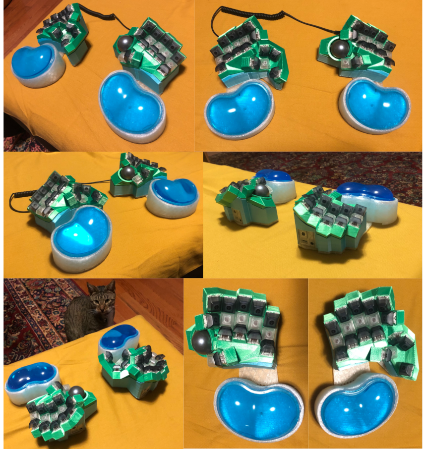

# Build Guide

## Tools

- 3D printer (I use a modestly upgraded Ender 3)
- Raspberry Pi with [Octoprint](https://octoprint.org/) for remote printing (recommended)
- Soldering Iron with [M2, M3 insert tips](https://www.amazon.com/gp/product/B08B17VQLD/ref=ppx_yo_dt_b_search_asin_title?ie=UTF8&psc=1)
- Solder fume extractor
- Safety goggles
- Sharpie pen
- X-Acto Knife
- Multimeter with continuity beep and alligator clips
- Hot glue gun
- Heat gun and heat shrink tubing
- PTFE tape (also known as "plumbers' tape")
- Wire cutters
- Needle-nose pliers
- Caliper (digital recommended)
- Keyswitch/Keycap puller
- [0.6mm nozzle](https://www.amazon.com/gp/product/B093SKXHL3/ref=ppx_yo_dt_b_search_asin_title?ie=UTF8&th=1) (recommended for faster prints)
- [Blu-Tack](https://www.amazon.com/gp/product/B001FGLX72/ref=ppx_yo_dt_b_search_asin_title?ie=UTF8&psc=1)

## Bill-of-Materials

Part | Price | Comments
-----|-------|----
[Arduino Micro without headers](https://www.amazon.com/dp/B01N1MJYK3/ref=twister_B09TRPJVK6?_encoding=UTF8&psc=1) | $23.88 | This is needed only for the right (trackball) half of the keyboard (you can get away with a pro micro on the left half). I like to get the version without headers and solder my own headers on the top to reduce its overall height.
[Arduino header strip](https://www.amazon.com/MCIGICM-Header-2-45mm-Arduino-Connector/dp/B07PKKY8BX/ref=sr_1_3?crid=2FCSAJKTFP6FH&keywords=Arduino+headers&qid=1675438451&s=electronics&sprefix=Arduino+header%2Celectronics%2C445&sr=1-3) | $4.99
[Pro Micro MCU](https://www.amazon.com/gp/product/B08THVMQ46/ref=ppx_yo_dt_b_search_asin_title?ie=UTF8&psc=1) | $19.88 | For the left half. BE CAREFUL WITH THESE! They're pretty flimsy and I've broken the USB headers on muliple of them, so it's good to get a few in case something happens.
[PMW3360 Motion Sensor](https://www.tindie.com/products/jkicklighter/pmw3360-motion-sensor/) | $29.99 | Trackball motion sensor.
[Key switches x35](https://www.amazon.com/gp/product/B07X3WKM54/ref=ppx_yo_dt_b_search_asin_title?ie=UTF8&psc=1) | $34.99 | If you're new to mechanical keyboards Gateron browns are probably a safe option.
[Keyswitch with a good amount of actuation force](https://www.amazon.com/gp/product/B078FMPZ8R/ref=ppx_yo_dt_b_search_asin_title?ie=UTF8&psc=1) | $20.99 | This is for the trackswitch -- some force is needed to push the trackball up, but too much force can make the motion less smooth; I recommend getting a sample pack like this one so that you have a few alternatives to try. In my case I ended up going with a Kailh Silver.
[Trackball](https://www.aliexpress.us/item/3256803106743416.html?spm=a2g0o.productlist.main.7.559e75b6LrrWPq&algo_pvid=5b156845-75aa-4609-92bb-10b4919b35ad&algo_exp_id=5b156845-75aa-4609-92bb-10b4919b35ad-3&pdp_ext_f=%7B%22sku_id%22%3A%2212000025055404434%22%7D&pdp_npi=2%40dis%21USD%2123.46%2111.03%21%21%21%21%21%402102186a16738183211058438d0674%2112000025055404434%21sea&curPageLogUid=fiwnZejyx836) | $11.99
[3x6mm Dowel Pins](https://www.amazon.com/gp/product/B07M63KXKS/ref=ppx_yo_dt_b_search_asin_title?ie=UTF8&psc=1) | $7.49
[3x6x2.5mm Miniature Bearings](https://www.amazon.com/gp/product/B00ZHSQX42/ref=ppx_yo_dt_b_search_asin_title?ie=UTF8&psc=1) | $10.99
[Silicone wrist rests](https://www.amazon.com/gp/product/B01LYBFIJA/ref=ppx_yo_dt_b_search_asin_title?ie=UTF8&th=1) | $9.99 | Nice and soft and squishy and comfy!
[PLA 3D Printer Filament (at least 1000 grams)](https://www.amazon.com/gp/product/B07PGY2JP1/ref=ppx_yo_dt_b_search_asin_title?ie=UTF8&th=1) | $17.63 | 
[Keycaps x35](https://www.amazon.com/gp/product/B07SJKMNWC/ref=ppx_yo_dt_b_search_asin_title?ie=UTF8&psc=1) | $15.55 | If you have a resin printer, printing keycaps is also apparently an option.
[1N4148 diodes x36](https://www.amazon.com/gp/product/B079KJ91JZ/ref=ppx_yo_dt_b_search_asin_title?ie=UTF8&psc=1) | $5.99 |
[Hot swap sockets x36](https://www.amazon.com/gp/product/B096WZ6TJ5/ref=ppx_yo_dt_b_search_asin_title?ie=UTF8&psc=1) | $14.50 | 
[MicroUSB to USB cable](https://www.amazon.com/gp/product/B01NA9UCVQ/ref=ppx_yo_dt_b_search_asin_title?ie=UTF8&psc=1) | $7.99 | To connect keyboard to computer (make sure the length is enough for your own setup!).
[TRRS cable](https://www.amazon.com/gp/product/B07FFW8YZR/ref=ppx_yo_dt_b_search_asin_title?ie=UTF8&psc=1) | $8.99 | This connects both halves of the keyboard, so make sure to get one that is long enough for whatever split you are going to make.
[Jumper wires](https://www.amazon.com/gp/product/B08151TQHG/ref=ppx_yo_dt_b_search_asin_title?ie=UTF8&psc=1) | $8.99 |
[Thin solder wire](https://www.amazon.com/gp/product/B076QG9N13/ref=ppx_yo_dt_b_search_asin_title?ie=UTF8&psc=1) | $11.59 | 
[Solid core jumper wire](https://www.amazon.com/gp/product/B07TX6BX47/ref=ppx_yo_dt_b_search_asin_title?ie=UTF8&th=1) | $15.99 | 
[TRRS connectors](https://www.amazon.com/gp/product/B07KY862P6/ref=ppx_yo_dt_b_search_asin_title?ie=UTF8&psc=1) | $6.99 | 
[Reset buttons](https://www.amazon.com/gp/product/B07CG6HVY9/ref=ppx_yo_dt_b_search_asin_title?ie=UTF8&psc=1) | $8.99 | 
[M2, M3 threaded inserts](https://www.amazon.com/gp/product/B07WH59N6T/ref=ppx_yo_dt_b_search_asin_title?ie=UTF8&psc=1) | $18.99 | You will only need 22x M3 and 2x M2 inserts for this build, but these are very commonly used in 3D printing projects so it's good to have a complete set. In my particular build I used [these M3 inserts](https://www.amazon.com/gp/product/B08T7M2H4S/ref=ppx_yo_dt_b_search_asin_title?ie=UTF8&psc=1) left over from a HeroMe Gen6 build.
[M2, M3 screws and washers](https://www.amazon.com/gp/product/B07F74JHBD/ref=ppx_yo_dt_b_search_asin_title?ie=UTF8&th=1) | $28.99 | Again, good to have a full set for other 3D printer projects.


Total: $357.36

This is a bit of an overestimate, considering that a lot of the listings above come with
more pieces/material than needed (and you may already have some of these things lying around).
Personally, I like to have two keyboards (one for at home and another for on-the-go/redundancy in case one breaks),
and if you want to build a second keyboard,
the items you will need to re-purchase are the keycaps, trackball, Arduino Micro, Pro Micro (possibly), PMW3360, and silicone wrist wrests
for an additional $111.28. Two of these keyboards for less than $234.33 each sounds like a pretty good deal to me!

## Preliminary Measurements

The code in this repo is parameterized to the parts I have purchased above,
however, as any responsible consumer knows, if one already has (or is able to find a better deal on)
similar-enough alternatives, it is indeed the ethically correct choice to make use of them!

Listed below are the parameters that can be tweaked to accommodate such alternatives,
with accompanying images of how to take the correct measurements.

### `trackball-width`

The diameter of the trackball. When measuring, turn it a bit in the calipers to make sure that you have captured the full diameter.

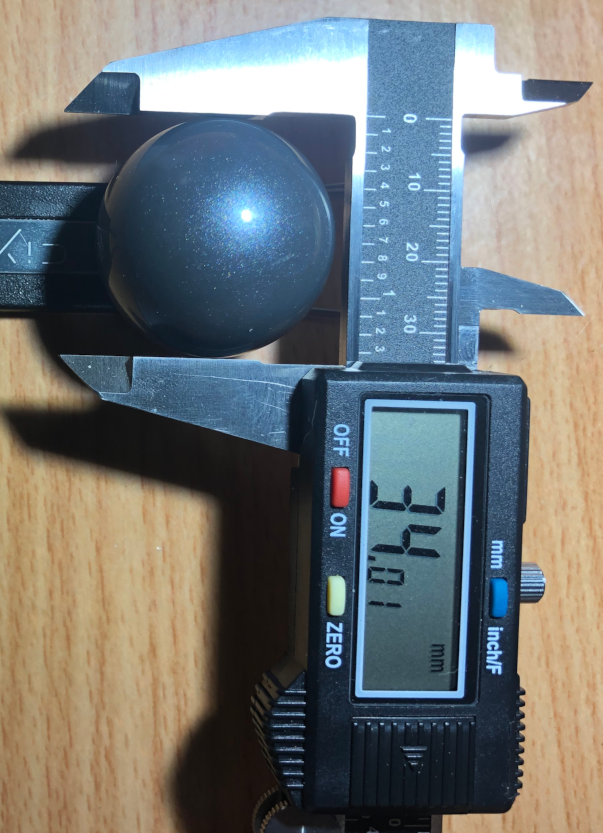

### `dowell-height`

The height of the dowels (apologies for the inconsistent spelling).

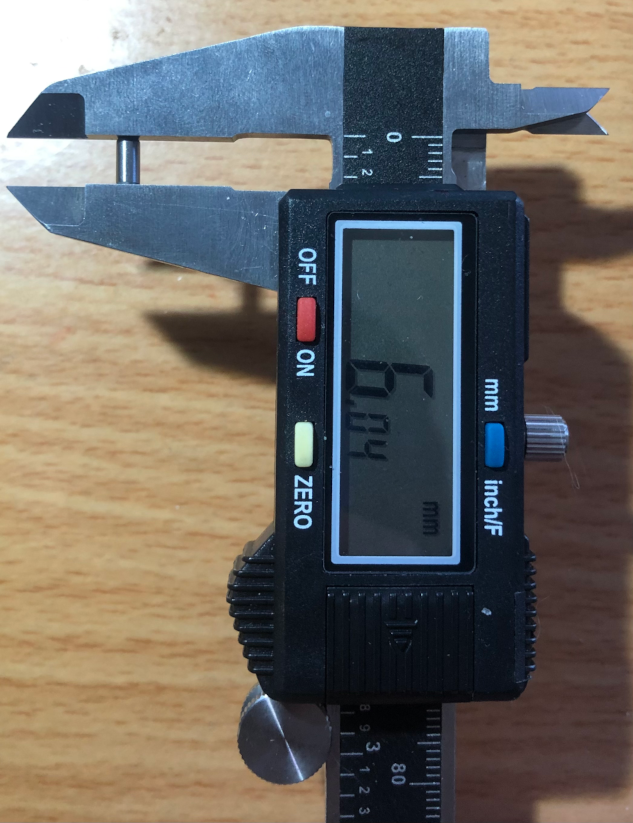

### `sa-height1`

Distance from the bottom of the keyswitch brims (where they contact the case) to the bottom of the keycap.


### `sa-height2`

Distance from the bottom of the keyswitch brims (where they contact the case) to the top of the keycap.


### `sa-length`

Width/length of the keycap base (assuming a square keycap).

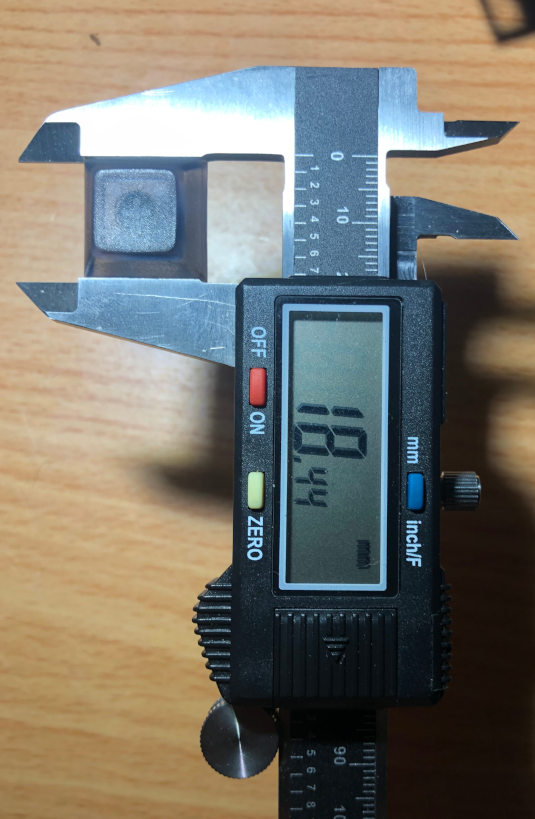

### `sa-length2`

Width/length of the keycap top (assuming a square keycap).

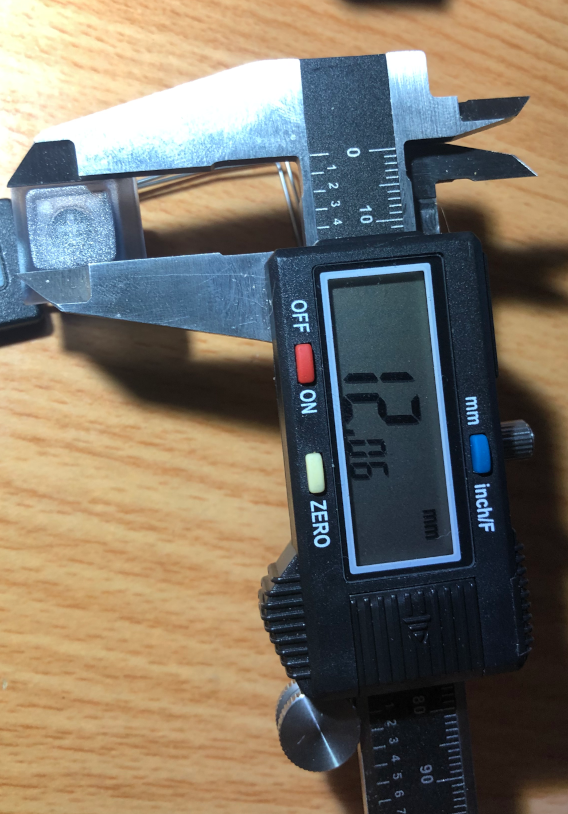

### `M3-insert-rad`

Radius of the M3 brass insert. If your insert has one flat half and one knurled half like mine,
use the radius of the flat half. Otherwise, go a little smaller than the actual radius
(so it will be able to insert properly and not just slide through).

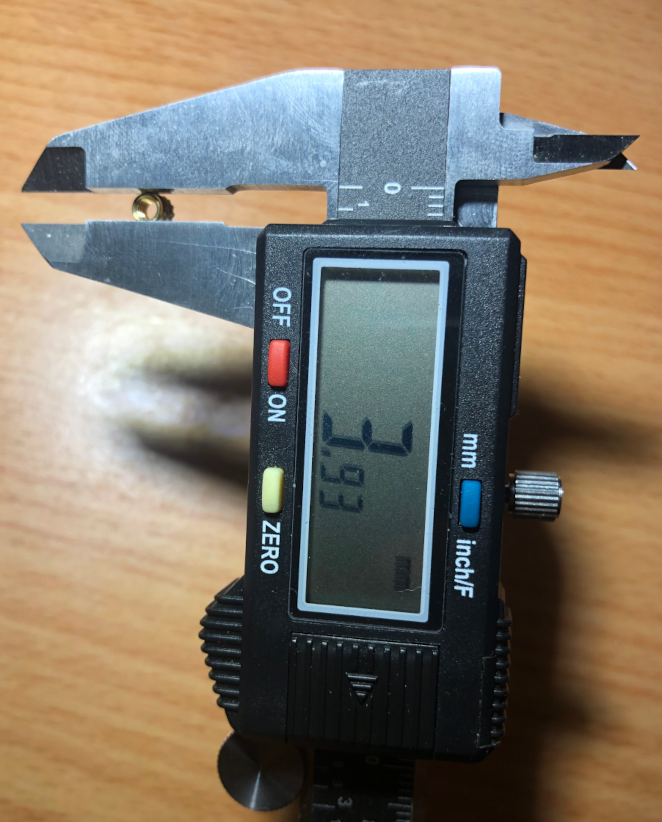

### `M3-insert-height`

Height of the M3 brass insert, you may want to add a bit of buffer to this.

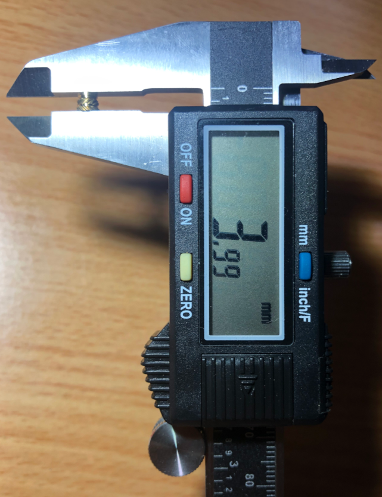

### `M2-insert-rad`, `M2-insert-height`

Repeat the above measurements with the M2 insert.

### `M3-screw-head-depth`

Height of the head of the M3 screw.

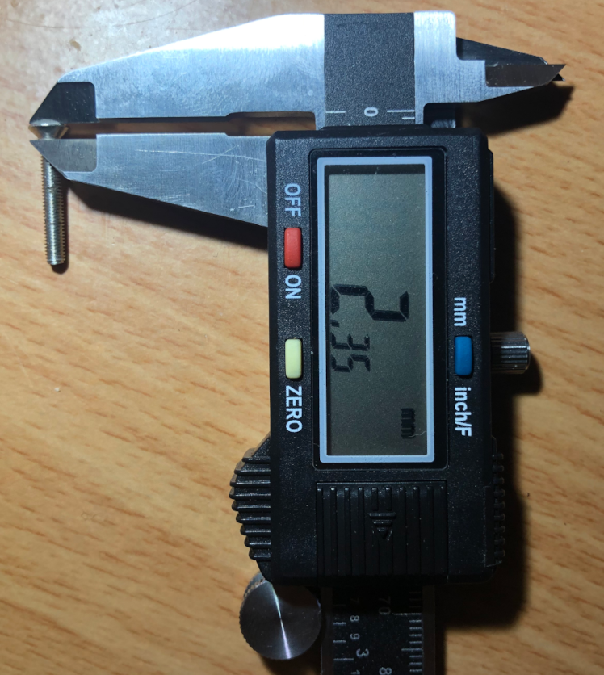

### `M3-washer-rad`

Outer radius of the M3 washer.

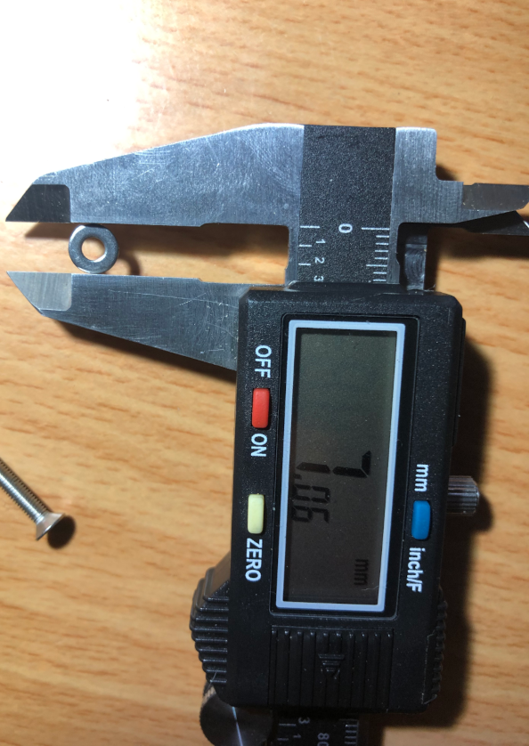

### `M2-screw-head-depth`, `M2-washer-rad`

Repeat the above measurements with the M2 screw/washer.

### (`src/usb_holder.clj`) `reset-height`, `reset-width`

Measure the height and width of your reset button.

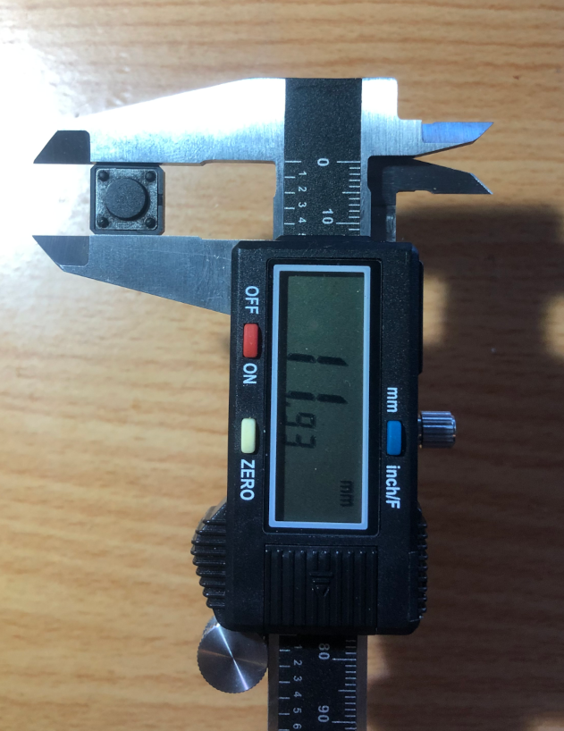

(leave the added `clearance`).

### (`src/usb_holder.clj`) `reset-protrude`

Measure the protrusion of the reset button from the highest point on the base (that will press against the case when mounted):


Add a bit to this if you want the button to be more recessed in the case.

### (`src/usb_holder.clj`) `reset-diam`

Measure the diameter of your reset button.


## Making Adjustments/CAD Generation

### How to Generate the CAD Files

This keyboard is designed using the [OpenSCAD software](https://www.openscad.org/),
which compiles OpenSCAD code (`.scad` files) into an output `.stl` 3D model file
that you can then feed into a 3D Printer slicer to output the `.gcode`
file containing instructions on how to move the print axes/feed the extruder/heat the hotend+bed to actually print the thing.
However, the OpenSCAD language is fairly niche and doesn't have a lot of user-friendliness support outside of its custom IDE.

For this reason, most iterations of Dactyl Manuforms have been implemented primarily or entirely in
Clojure and transpiled to OpenSCAD (`.scad`) using the [`scad-clj` package](https://github.com/farrellm/scad-clj)
(you don't have to install this yourself, `lein auto generate` below should do it for you).
For this transpilation, you will need an additional piece of software called [leiningen](https://leiningen.org/).

Once everything is installed, run
```bash
lein auto generate
```
which will populate the `things` directory with various `.scad` files.
Now, as you modify the `.clj` files, leiningen will automatically run 
and produce a new `.scad` file after you save any `.clj` file.

The parameterization is split into two files:
- `src/dactyl_keyboard/dactyl.clj` -- the main file where the keyboard is parameterized
- `src/usb_holder.clj` -- parameterization of the MCU holders

### Testing Changes (the `testing` variable)

At the very top of the file, you will find the `testing` variable.
Set this to `true` while you make changes to the overall keyboard layout
(you can just swap it with the line above to override it).
This will produce just enough code in the `things/test.scad` file
for you to have a good enough idea of how the keyboard is going to look
without including so much detail that it becomes impossible to view in
the OpenSCAD preview.

To control what actually is output for testing,
got to the `(when testing (spit "things/test.scad" ...`
block near the end of the file.
There, you can just paste in various parts from the
`(when (not testing) ...` output block right above (you can skip the `cura-fix` wrappers)
to get the test output of that part.

Once you're done, be sure to set `testing` to `false` again so that
the full parts incorporating your recent changes are actually output.

### Parameters to Tweak

Note that the code is unfortunately a bit messy at the moment, and there
may be several parameters lying around that I haven't bothered to maintain
or have silently deprecated. If any parameter isn't explicitly mentioned in this guide,
it probably means that you shouldn't mess with it
(unless of course you've read the code and know exactly what that would entail).

Below are the most likely parameters you'll want to tweak in order to get
this keyboard to exactly fit the shape of your hand:

#### Adjusting Key Offsets

- `column-offset` -- The xyz-offsets of each of the columns (but you should keep the x value at 0).

- `thumb-pos` -- The xyz-offsets of the thumb key.

#### Adjusting the Vertical Keys

The vertically actuated keys are placed using the function `key-vert-place`,
which takes a few parameters that can alter its position relative to the
default (i.e. all-parameters-set-to-zero) position.
This default position aligns
the bottom edge of the top of the vertical switch's keycap
with
the top edge of the top of a normal horizontally-placed switch's keycap,
such that the vertical keyswitch is at a 90 degree angle relative to
the normal one.

To place the vertical keys, there are various parameters
whose names follow the pattern of the upper switch's "code"
with the following suffixes, where the paired animation shows
how adjusting this parameter will affect the placement of the vertical key.

- `*-z-rot`

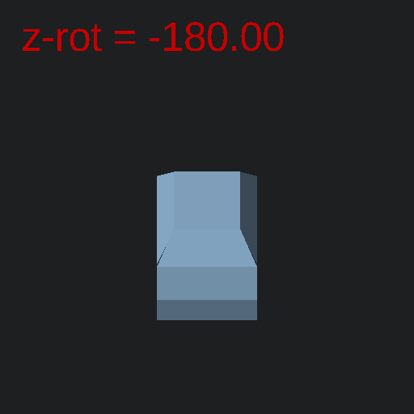

- `*-extra-dist`

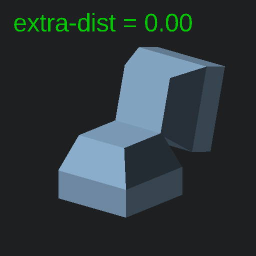

- `*-x-off`


- `*-x-rot`

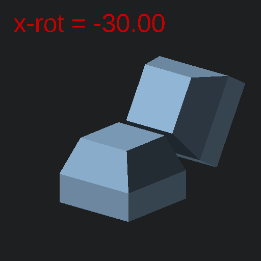

- `*-z-off`


- `*-init-z-rot`

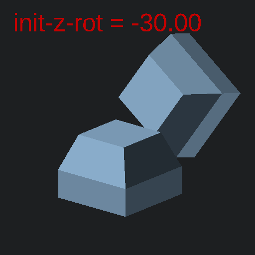

#### Adjusting the Above Keys

See `above-z-rot`, `above-extra-dist`, `above-x-rot`, `above-z-off`, `above-init-z-rot`.

Note that there's a bit of a tradeof with these keys when it comes to the `above-x-rot` parameter.
Steeper of an angle means shorter travel distance, but it also means that you will have to keep
your fingernails short in order to actuate them comfortably.
If you aren't ready for this commitment, I recommend using a flatter angle.

#### Adjusting the Below Keys

See `below-z-rot`, `below-extra-dist`, `below-x-rot`, `below-z-off`, `below-init-z-rot`.

#### Adjusting the Left-of-Index Keys

For the vertical key to the left of the RH homerow index key (`h` on the QWERTY layout), see
`h-z-rot`, `h-extra-dist`, `h-x-off`, `h-x-rot`, `h-z-off`, `h-init-z-rot`.

For the vertical key to the upper-left of the RH homerow index key (`y` on the QWERTY layout), see
`y-z-rot`, `y-extra-dist`, `y-x-off`, `y-x-rot`, `y-z-off`, `y-init-z-rot`.

#### Adjusting the Thumb Cluster Layout

See the prefixes in the image below:


The mnemonic is that
`thumb-u` stands for "thumb upper",
`thumb-uo` stands for "thumb upper-out",
`thumb-i` stands for "thumb in" (as in moving your thumb inwards),
`thumb-o` stands for "thumb out" (as in moving your thumb outwards), and
`thumb-d` stands for "thumb down" (as in pressing your thumb down).

#### Repositioning the Screw Insert Mounts

This keyboard features four screw insert mounts on the switch plates to connect the case walls to the switch plates and
five screw insert mounts on the walls to connect the case walls to the base.
These are manually positioned, so if you change the layout of the keys, you'll probably have to reposition these as well.

For the wall insert mounts, parameterized in `screw-insert-all-shapes`, make sure they have enough overlap with the case walls.
For the switch plates insert mounts, parameterized in `top-screw-insert-all-shapes`, make sure they're high enough so that they have good purchase with the rest of the part,
but not so high that they cut a hole through the top.
You'll also have to check the corresponding adapters below them on the case walls part to make sure that they
have the correct rotation relative to the case walls and also have enough purchase onto them.

#### Repositioning the MCU Holder Cutout

If you change the position of the above-home-row keys, you'll probably also have to
change the position of the MCU holder cutout.
When rendering the case walls with `testing` set to `true`,
it will also render a ghost of the MCU holder to help you position it properly.

Tweak the variables `usb-holder-z-rotate` (which rotates the holder about its front right edge)
and `usb-holder-offset` to position it such that it is flush with the wall of the case
as you see below:

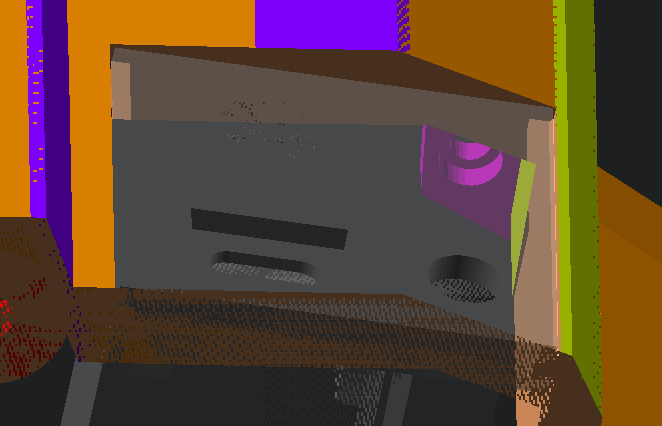

Note that the top left corner of the MCU holder may come close to the top edge
of the case and even cut through it.
If it is too close, there should be no harm in letting the cutout cut into the inner case wall a little bit
to get it further from that edge.

#### Changing the Height and Tent Angle

You can alter the overall height of the keyboard with the `keyboard-z-offset` variable.

Another important aspect of a split keyboard is what's known as the "tent angle",
which is set with the `tenting-angle` variable.
This affects the degree to which the halves are "tented" upwards so that your wrists
can assume a more natural angle than being completely flat.


## Slicing and Printing

### Switch Plates

#### Prototyping

In order to truly know if your parameterizations provide a good fit for your hand,
you will have to print the switch plates and try it out.
Unfortunately this keyboard is not at all adjustable once printed (aside from the wrist wrests), 
so you will likely incur some wasted prints during the process of refining this.

The output contains the
`things/thumb-test-right.scad`
and
`things/thumb-test-left.scad`
files to allow you to print the thumb clusters by themselves
so that you can iterate on those with minimal waste.

I plan to soon also add a way to just print the homerow and `thumb-c` switch plates
in a coherent prototyping part so you can quickly check their relative positions.
However, if you can't wait for that, your only option for now
is to print the entire switch plate.

Once printed, you can install the keys and get a feel for the keyboard by typing the phrase: "great xerxes saw qatar as a vast deceased cat tree" (assuming that you printed the left half -- sorry, that's the best I could come up with, really).

#### Slicer Settings

Printing the switch plates absolutely requires supports.
I recommend using the "tree supports" provided by Cura Slicer.
These supports have always worked perfectly for me and
are particularly easy to remove from the model.
Be sure to carefully check the generated supports before printing,
I have noticed that the slicer sometimes attempts to create tree supports in thin air.
If you observe this, I recommend turning the "Tree Support Branch Diameter Angle" setting
down to 1.0 degree so the supports are less wide at the base.

I also recommend using a brim when printing. This will come off with the supports,
so you don't have to worry about it leaving any ugly edges on the model.

Lastly, I have discovered that it is perfectly fine to print this model with
a 0.6mm nozzle and at 0.28mm layer height. This will substantially cut down your print time
relative to the default 0.4mm nozzle with 0.2mm layer height.
You may lose some of the finer details on the plates, but I ended up not making use of them anyways.

Otherwise, I use all of the default Cura settings (remember to set it to use a 0.6mm nozzle size if you are using one).

#### Aligning the Support Blockers

Firstly, go to `Preferences -> Configure Cura` and uncheck "Automatically drop models to the build plate".

Now, load in `switch-plates-{left or right}.stl`
and the corresponding`vert-support-blockers-{left or right}.stl`.
The support blockers are meant to prevent unnecessary and difficult-to-remove supports
from being generated in the vertical keys.
Cura might automatically rotate one of the models, so if this happens,
rotate it to the same orientation as the other part.
Now, try to approximately align the support blockers with the switch plates.

You'll notice on the build plate two tiny squares. Try to microadjust now and align so those squares coincide
(you don't have to be too perfect).


Now, select the support blocker model, go to "Per Model Settings" and click "Don't support overlaps".
Then, select all (ctrl-A), right-click and select "Group Models" so that everything will move together as you do the final orientations.

#### Orientation

When orienting the switch plate, make sure to rotate it so there aren't any sharp corners
that will be printed as single points in a layer -- that is, all corners should be printed
as part of a line of filament.
Double-check in the layers preview after slicing that this is really the case!
One trick that I have found useful is to orient the part such that any problematic corners
are at the lowest point in the model and pushed slightly below the build plate
(so they will be cut off a little bit and not printed as points).
By rotating the part, you should be able to protect at least two corners in this way:


Accommodating this requirement may result in some additional support material,
but this is well-worth it to prevent failed corners, or, in the worst case, a failed print.

#### Printing

I highly, highly recommend having an [Octoprint](https://octoprint.org/) setup with a camera for this.
If you use the 0.6mm nozzle as recommended above the print should take 13-15 hours.
You should start the print early in the morning (as soon as you wake up).
It's probably a good idea to smear your buildplate with glue before printing to help prevent any bed adhesion problems.
Unless you have good safety precautions [like thermal fuses](https://www.youtube.com/watch?v=tTJfASOHojo)
installed on your 3D printer,
don't be tempted to leave your printer running overnight -- if for whatever reason the print fails halfway through,
diagnose the problem, sigh, and try again the next morning.

In any case, I also recommend having an AI failure detection system like [Gadget](https://octoeverywhere.com/launch) set up.

#### Removing Supports

The first step to removing supports is to PUT YOUR SAFETY GLASSES ON.
After you have them on, put your hand on your face to make sure they're really there.

While the support blockers should have prevented the supports behind the vertical keys
from getting too crazy, there is still probably a bit of tree support back there.
Use a pair of needle-nose pliers to press into the holes of the switch plates in each of the vertical keys
to break those supports away (you should hear a satisfying crunch as you do this).

The keyboard has four insert adapters that can easily break of during the process of removing supports.
To avoid this, you may want to try to carefully cut away the supports from around them.
Use a hefty pair of wire cutters to do this -- NOT the ones supplied with your 3D printer!!!
If you do end up accidentally breaking one of them anyways, don't worry!
As long as there is enough left to insert the insert into,
a screw should still be able to reach it and hold the plates securely.

Using your pliers, go all around and gently loosen up the supports from the part by grabbing it and wiggling it around.
Then, once everything feels loose enough, pull the supports out, being careful not to injure yourself once they finally come out from behind the vertical keys.
There may still be some support residues left behind the vertical keys after you do this, so be sure to check and pull them out if so.

### Case Walls

You can use the same slicing settings to print the walls. You will need supports because of the MCU holder cutout.

### MCU Holders

You can actually print these without supports!


### Trackswitch Mount

This one need supports, I recommend orienting it as follows:


### PMW3360 Sensor Case

No supports needed! Orient it as follows:


### Bottom Plates

No supports needed, be sure to rotate these so that the flat side is on the bottom.
I was able to squeeze both of them on the build plate (of an Ender 3) to print at once,
but it's probably a better idea to print them one at a time.

### Wrist Rest Holders

You will need supports for these.


## Electronics

As you may have guessed, the electronics for this keyboard consist of two main components:
the key matrix (of which the trackswitch is just an extension) and the PMW3360 trackball sensor.
Each half of the keyboard has its own MCU to connect to the matrix and trackball sensor (in the right half),
and these are connected together via a TRRS cable to transmit power and data between the two halves.
Additionally, you can (and should) add a reset button each MCU to allow for easy firmware flashing
whenever you want to change the keyboard layout.

The firmware treats the right half as the "main" half of the keyboard in that
that is the half that you plug into your computer via USB.
You'll only ever have to plug in the left half when you do a firmware flash.

You can see the PMW3360 as simply a plug-and-play device (whose functioning is far beyond the scope of this guide)
that requires no special care beyond making sure that you insert all of the pins correctly.
See [noahprince22's explanation](https://github.com/noahprince22/tractyl-manuform-keyboard/blob/master/README.md#soldering)
for an intuitive understanding of how the electronics of the key matrix works.

### Right Side

The right side uses a full Arduino Micro so that
we have all of the pins that we'll need for the trackball sensor.
See the wiring diagram below:


### Left Side

On the left side, we can get away with the cheaper Pro Micro:

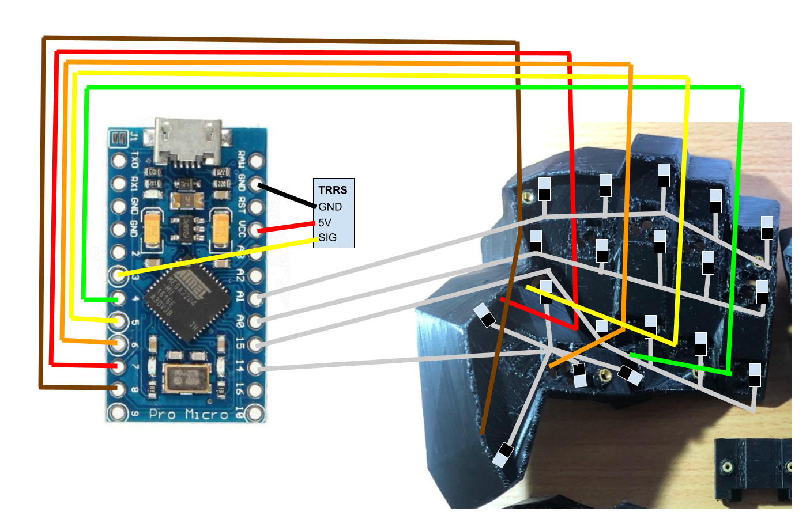

### Hotswap Layout

Given the crazy angles of the keys, this keyboard is easiest to solder before inserting the hotswap sockets into the keyboard.
(The plates actually have holes for holding the diodes that we're not going to use; I just left them in since they make the keyboard a bit lighter).
So, for each half, start by laying out the hotswap sockets in the approximate shape of the keyboard,
using Blu-Tack to hold them in place.
Reference your printed switch plates to make sure that you leave
more than enough distance between them so that they can reach the keys that they need to reach.
This will undoubtedly result in spaghetti wiring underneath your keyboard, but hey, I like spaghetti, don't you?

Importantly, make sure that the hotswaps are *rotated correctly* to fit into their intended keyswitch mount.
One subtle difference between the two halves is that in the right half, the "`h`" key is rotated upside down
to make room for the trackball.
If you aren't sure, take a look at how I've oriented them in the pictures below.

Left half:

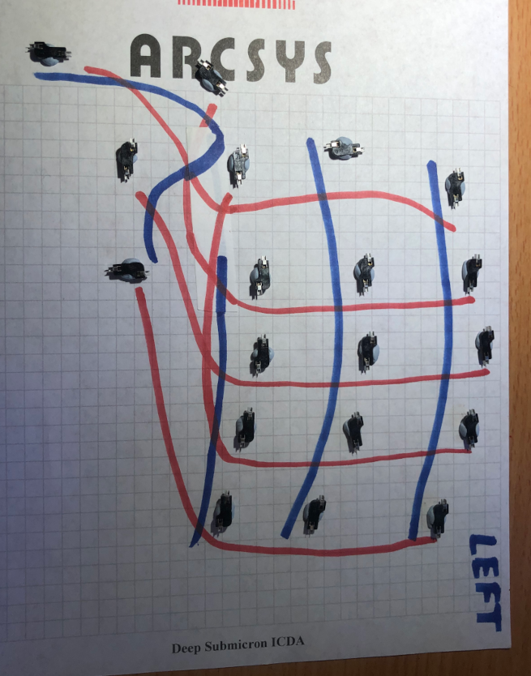

Right half:


### Pre-cutting the Row and Column Lines

This step involves pre-cutting the solid core wires that connect
the rows and columns of your keyboard (as shown in the diagrams above)
in such a way that we preserve the wire's insulation between the sockets.

For each row and column, start by cutting a length of wire that is a good 40-50 mm longer than the total length of each row/column in question.
Mark the start of this extra length with a Sharpie.
Note that some columns will have to reach their respective thumb keys
(and the third row will have to reach the trackswitch key in the right half),
and so will require a good amount of extra length for that.
Use Blu-Tack to keep the wires next to their rows/columns after cutting them:

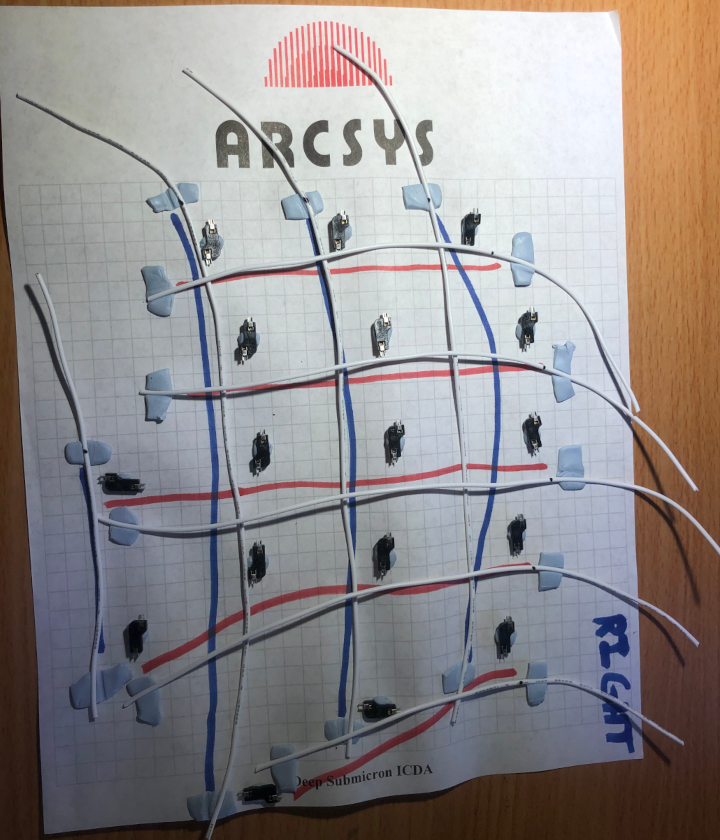

#### MCU Probe Tails

The extra length we included at the end of each line was
to provide a "probe tail" to which we can attach a probe from the MCU for reading the matrix.

Strip away about half of the extra length from the end of the line and 
use wire strippers to make a cut into the insulation at the place you marked with the Sharpie.
Use your pliers to make a small hook at the end of the wire
(which is where you will solder a probe from the MCU),
and use the wire strippers to pull the insulation to the end.
You should end up with this:


#### Alignment, marking, and cutting

Now is the time to make the cuts that will allow the lines to connect to the hotswap sockets.
For each row/column line, starting by aligning the bottom of the insulation above the probe tail
with the hot swap contact.
Now, make a mark with your Sharpie about 5mm above/to the side of the next hot swap contact:


Make a cut here with your wire strippers and pull the insulation down, leaving about that much room between
this insulation segment and the previous one:

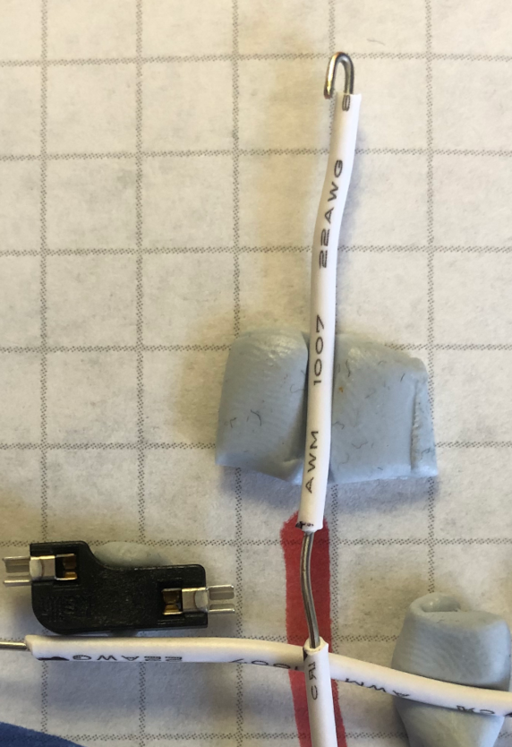

Move the top of the insulation below the segment you just cut up to the swap contact,
and repeat this process for the next socket.
To save time from switching between your marker and wire strippers,
you can instead make all of the marks before doing all of the cuts.
Continue until the very last one, cut off any excess, and make another hook at this end.
At the end you should have something like this:


#### Preparing the diodes

If you bought a diode set like the one listed above,
they come neatly packaged in strips that allow you to
bend and cut multiple at once.
Count out 36 diodes and separate cut them off from the rest of the strip.
Using some straight edge like the edge of a table to make the initial bend,
make a hook with the wire on the *black* side of the diode.
Make a cut so that you will have enough wire to be able to wrap the hook around the lines.
On the other side, cut again, leaving a few millimeters of wire.
Your cut diodes should end up looking like this:

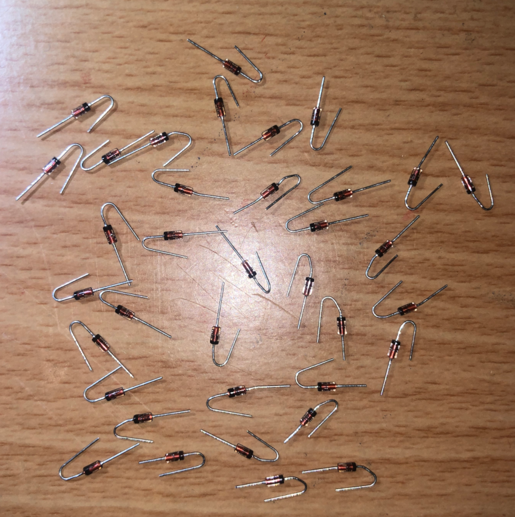

Don't throw away the small wire segments still attached to the strip!
We're going to use them as probes on the sockets to attach the column lines to.
Hook them on the strip side and cut them
so you have about a millimeter of extra length below the hook:


Now, I recommend getting two wads of Blu-Tack out
and using them to stick all of the diodes and column probes vertically into.
This will make it easy to pick them up with pliers for the soldering step
(I will spare you from a photograph of this since the sight of it evokes visceral disgust).

### Soldering

Take out your solder iron and solder wire. It's time to get serious about making this keyboard.

WARNING: Be sure to solder in a well-ventilated area with a fume extractor and safety goggles ON!

#### Pre-solder the sockets

Go to each hotswap socket and fill each rectangular contact with solder.
It's much easier to solder the diodes/column probes correctly into place without having to simultaneously
feed in solder with your third hand.

#### Pre-solder the diodes and column probes

Solder the diodes and column probes *vertically* into place on each hotswap socket.
It's important to do it vertically because if you make them jut out the sides
it will conflict with the walls of the switch plates in a few places.
You will end up with:


#### Solder the Row and Column Lines

For each of your row/column lines, twist the hook of each diode/column probe
around the corresponding exposed bit on the line to hold in in place.
Now, go around with your solder iron and solder everything up!
This should result in:

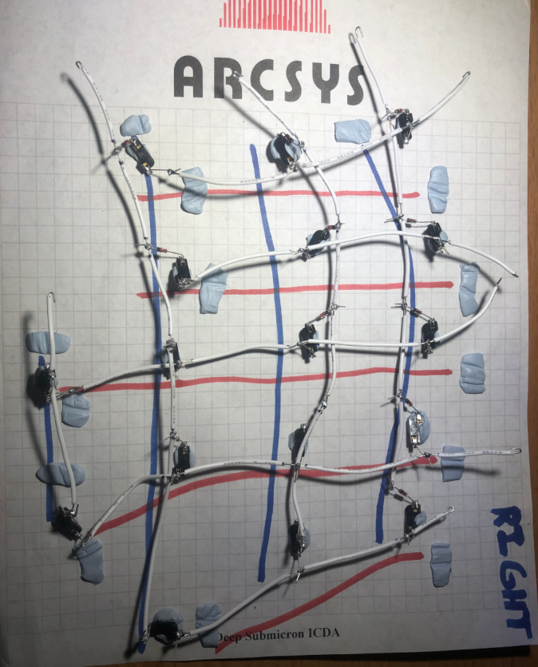

#### Solder the MCU Probes

Go around to each of the probe tails and fill the hooks that you made at the end with solder.
On each row/column probe, slide on a length of heat shrink tubing to cover both the hook on the end and
the plug end of a jumper wire.
Using plug-socket-end jumper wires, solder the plug ends into the hooks that you made at the end of each row/column probe,
and use your heat gun to insulate this connection with the heat shrink tubing, leaving you with:

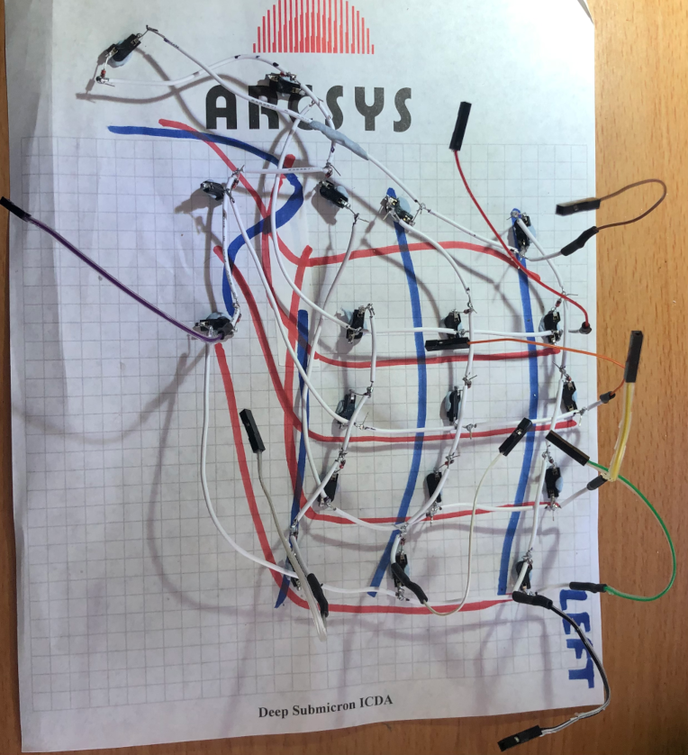

(I actually crimped my own jumpers without a plug end, so you will probably have more of a bulge underneath
your heatshrink tube from the plug housing).
You can now pull the wires off of the table and roll off all of the Blu-Tack.

#### Solder the PMW3360 Sensor

Using plug-socket-end jumper wires, solder the plug ends into the PMW3360 ports shown above. 
Cut off the excess now jutting out of the other end of the sensor so that the lens is able to fit without conflict:


#### Solder the Reset Button (MCU Assembly)

Cut two socket-socket-end jumper wires in half, strip away the insulation from the cut ends and solder them to
the reset button such that a connection is made between them when the button is pressed
(you probably want to use a multimeter to double-check this):


Repeat for the reset button on the other side.

#### Solder the TRRS Connector (MCU Assembly)

Cut three socket-socket-end jumper wires in half, strip away the insulation from the cut ends and solder them onto
the TRRS jack probes (it doesn't really matter which ones you use, as long as you're consistent on both sides):


(You can see that I have already inserted these into the MCU holder but this isn't actually necessary,
you can just use Blu-Tack to hold them in place while soldering like I did for the reset buttons above).

On the right side, we will actually need an extra ground pin, so fashion one of these short jumpers
with a single socket on one end, and two pins on the other:

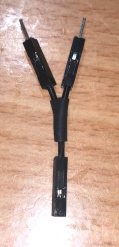

#### Check Everything

Go around and gently jiggle all of the soldered joints, checking that everything is solid before proceeding to the assembly.

#### Solder the MCU Headers

It's probably a good idea to use pins on your Arduino for a couple reasons.
Firstly, it makes it easy to fix any mistakes you may make when connecting things up.
Secondly, it gives you the option of re-using your MCU for a different project
if you find that this keyboard is not the best for you.
While the connections may not be as "solid" as directly soldering onto the board,
I have found that you can just use hot glue to keep everything in place
once you have verified that the keyboard is working as you expect.

The Arduino Micro with header options you find online will probably
have the headers pre-soldered on the bottom.
I find that this adds some unnecessary height to the board
because of the ICSP headers that jut out on the other side.
I would rather not cut those off (again, you may end up wanting to re-use this Arduino for a different project),
so I like to get the Arduino Micro without headers and solder my own headers on the top instead.

Cut off two strips of 17 pins each from the Arduino pin header strips.
When you try to fit them on the top, you may find that they conflict with some of the components protruding from the board --
if so, you should be able to strip away a bit from the plastic on the headers with an X-Acto knife to make room for them.

Get a wad of Blu-Tack and place the Arduino Micro with the pin headers upside-down
on it (so that the pins press into the Blu-Tack and hold the Arduino in place).
Try to make sure that the pins are at a 90-degree angle relative to the Arduino.

Now, heat up your solder iron and get a bit of solder ready.
When soldering a pin, first press your iron against both the pin and the contact on the PCB,
and wait for the components to heat up.
When you feed in the solder, press it against the pin and MCU contact, not the solder iron.
It should get "sucked in" all around the contact and the pin.
If it doesn't, it probably means that you didn't heat up both the pin and the contact on the MCU all the way,
so make sure that you have positioned the iron tip correctly and it is at a high enough temperature.
Make sure you feed in enough solder so that it goes all the way around the contact (i.e. doesn't leave any holes).

Regarding the Pro Micro, all on the options I have seen online with pre-soldered headers also put them on
the "wrong" side, at least for this build.
I like to have these headers on top as well because I like to use the flat side on the bottom of the board
to stick it onto the MCU holder strip.
There's a good chance that the Pro Micro that you bought came with a 12-header strip,
but if it didn't, the Arduino header strips should work just fine for this as well.
The soldering process should be identical to that of the Arduino Micro.

#### Inserting the Inserts

This is technically part of the assembly step, but is best to do right now while you have your solder iron out.
Take out your M2 and M3 inserts, wait for your solder iron to cool down, and replace the solder tip with
the M3 insert tip.
Insert the inserts into the four mounts on the bottom of each of the switch plates,
the bottom of the case walls, the trackswitch mounts on the right switch plates, and the bottom of the wrist rest holders.
Wait for your solder iron to cool down again, and replace the M3 insert tip with
the M2 insert tip, and insert two M2 insert into the back of the PMW3360 mount.
The parts with all of the inserts inserted should look like this:


(You can see a bit of a print failure on the trackswitch mount that I was lucky enough to be able to get around, leaving the insert half-exposed;
you can likely avoid this if you heed my advice above about orienting the switch plate in the slicer such that no corners are printed as single points).

## Assembly

Congrats on making it this far!
The final (physical) step is of course to put the electronics and keyswitches together with the
printed parts, and to set up trackball and trackswitch assembly.
Get your hot glue gun and M2/M3 screws+nuts+washers ready.

### Inserting the Hot-Swap Sockets

The first step is to insert the hot swap sockets you have pre-wired into the switch plates.
Be forewarned, this is probably the most annoying part of the assembly,
though certainly doable with enough patience.

The way that I do this for each key consists of three steps:
1. Use a pair of pliers to press the hotswap socket into its designated cutout behind the plate, being careful not to put too much pressure on the soldered joints.
For the vertical keys in particular, this may take a bit of wiggling, but as long as you've oriented the socket correctly and have cleared away all of the support residue behind the vertical keys, you should have absolute faith in your ability to complete this irksome task!
2. Continuing to press the plier against the socket, take a keyswitch and plug it in.
I have found it particularly easy to bend the pins on the switch while doing this (fortunately though this can be easily rectified with some pliers), so go slowly and take it out and try again if you're not sure. Now, the keyswitch should hold the socket in place so you can move the pliers away.
3. Use your hot glue gun to put a good amount of glue behind the socket to fix it in place (if you're really sure, go ahead and flood the area).
After it's dry, plug the switch in and out a few times to make sure it stays
(if it doesn't, which probably means you didn't use enough glue or didn't place it correctly, use your pliers to pull out the hot glue and try again).

On the right side, leave the trackswitch socket dangling for now,
you will install that after the trackswitch has been mounted.
After all is said and done, you will have something like this:


And promise me, no matter how much it looks like spaghetti, that you will not try to eat it!

### Mounting the Trackball

Get out the right switch plates, the trackball, and the small dowels and bearings (3 of each).
Insert each of the dowels into bearings such that the bearings are halfway down the dowels.
Inside the trackball mount on the switch plates, you'll notice three cutouts
where these are to be inserted.
This should be a very tight fit so you will probably have to use some pliers to help you snap them in.
If you're really having no luck with the pliers, you can use a solder iron to heat up the dowels
and gently and slowly press them in.

Now, insert the trackball and spin it around a bit to make sure the motion is smooth.
Since the bearings should be peeking through the case, you can also visually check to make
sure they are actually spinning as you move the trackball.

### Mounting the Trackswitch

Take out your multimeter, two plug-socket-end jumper cables, the trackball, the trackswitch mount, the M3 screws (12mm long), nuts, and washers (two of each), and the PTFE tape.
Wrap the M3 screw with a generous few layers of PTFE tape.
This tape will keep the trackswitch mount steady once it is screwed in,
and also help to keep the stablizing nut in place.
Put the washers on the screws and insert them into the trackswitch mount.
The washers should fit snugly into the cutouts on the top of the mount.

Screw on the nuts on the other side tight enough so that the screws aren't able to jiggle,
but not so tight that you aren't able to turn them (along with the nuts).
Getting this balance just right can be tricky. If you find that you can't get the nuts tight enough
without them catching on the part, I suggest that you fashion some small plastic washers
to place between the nut and the mount (you can try to use a normal metal washer but in my experience these also tended to catch).
You can make one of these by taking a 7/64 drill bit and carefully making a hole in a thin piece of plastic
(like a grape container), and cutting out a small circle around it.
Be sure to deburr the hole so that both sides of the washer are flat.
You may find that you need to use a couple of these washers on a single screw.
It will end up looking something like this once installed:

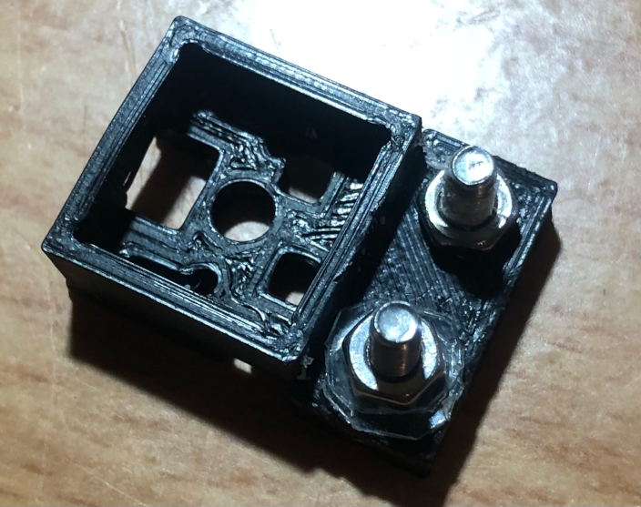

Screw both screws into the corresponding inserts on the right switch plates just enough so that the mount takes hold.
Take the trackswitch keyswitch you have chosen, remove the trackball, and insert it into the trackswitch mount (through the square hole on the trackball mount).
Plug in the socket ends of your jumper wires onto the pins on the switch and clip the alligator clips of your multimeter onto the plug ends.
Turn on your multimeter and put it into continuity beep mode.

Now, take an M3 allen wrench, and with the trackball pressed down,
proceed to make equal and incremental tightenings of both screws until you hear a beep.
As soon as you do hear a beep, spin the trackball around a bit to make sure that it is consistent
(both imperfections on the surface of the trackball and movement of the actuator within the switch
housing can make this inconsistent).
If it isn't, continue to make microadjustments until it is.

Orient your switch plates approximately how they will be once mounted.
When you release the trackball, it should lift up and the beep should stop.
Whether or not this happens depends on two factors: the actuation force of the keyswitch used and the pitch of the plates.
The pitch of the plates should be far enough forward such that the force of the spring in the keyswitch
is able to push the trackball out. If it is too far back, the force of gravity will exceed the force of the keyswitch and
the trackball won't be able to pop out.

If this doesn't happen, then there are three possible issues:

- You have it pitched too far back, so make sure that it is rotated towards you to the same extent that it will be when mounted on the case (but don't go too far as this could give you a false sense of success).
- Your keyswitch doesn't have a high enough actuation force. I recommend a linear switch, and have had success with a Gateron Black and a Kailh Silver.
- You may want to additionally tighten the screws a bit to reduce the distance from the trackball to the switch
(and thus increase the force of the switch on the trackball). Make sure that you do not go too far,
and use your multimeter to verify that when you release the trackball the connection is still broken.

If you find that the beep doesn't stop when you release the trackball, it means that you went too far in the previous step --
unfortunately, since loosening tends to also loosen the nuts keeping the trackswitch mount steady,
in this case you'll probably have to take the whole assembly out, re-tighten the nuts, and start from the beginning.

Once you have gotten the distance perfect, as a final step smear everything
with a good amount of hot glue to ensure that nothing will come loose
(don't let any get inside of the trackball mount).
Finally, install the trackswitch socket that was left dangling earlier.

Your mounted trackswitch should like this (before getting covered in hot glue; again, forgive the semi-print-failure I mentioned earlier):

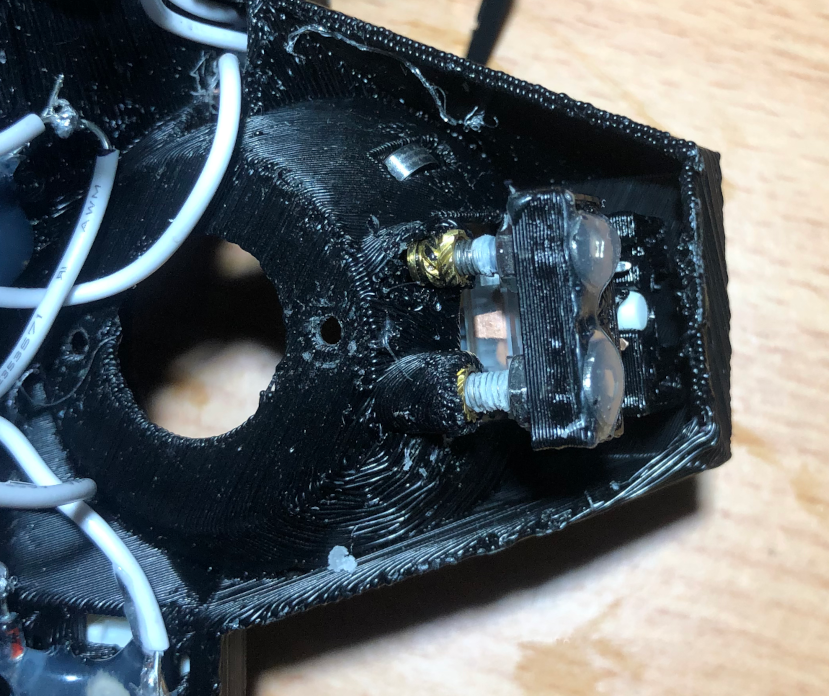

### Mounting the PMW3360

Take out the PMW3360 sensor, the PMW3360 mount, and the M2 screws (20mm long), nuts, and washers (two of each).
Gently press the PMW3360 sensor into the mount, oriented such that the protruding jumper ends are on the same side as their cutout on mount.
The mount should hold both the sensor and the lens securely together.

I have found that on the right side, there is actually quite a tight fit between the Arduino Micro and the trackball sensor.
This would not be an issue if it weren't for the height of the jumper cable plug/socket housings,
but if you are planning to use pins (as I do in this guide) rather than soldering directly onto the MCUs,
I recommend bending the pins to give just enough clearance between the MCU and PMW3360 connection.
For the Arduino Micro (you can't see in this image but I only bent the last 7 pins on the left side, and also
the 6 ICSP pins:


and for the PMW3360:

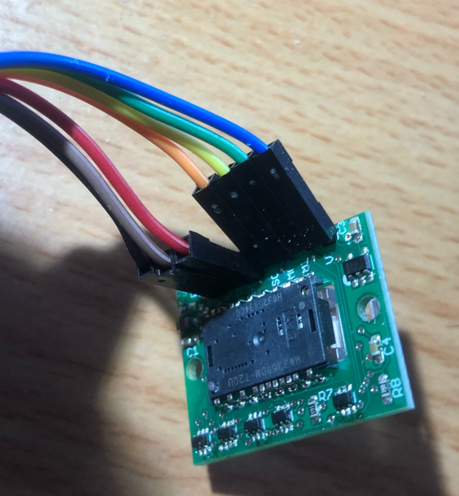

Wrap the M2 screw with a generous few layers of PTFE tape.
Put the washers over the screws and insert the screws into the trackball mount (the washer should be on the inside).
Screw on the nuts on the other side tight enough so that the screws aren't able to jiggle
(optionally, you may use washers on this side as well if it helps),
but not so tight that you aren't able to turn them (along with the nuts).
If you can't exactly achieve this, that's okay, just make sure the nuts can spin without catching
(Blu-Tack will come to your rescue)!

Insert the screws through the holes in the front of the mount and the holes in the PCB,
then screw them into the inserts in the back of the mount.
Now, squeeze some Blu-Tack underneath opposite corners of the mount
as far as possible from the nuts.
This will add some extra stability as you make the final adjustment.
Continue to screw in incrementally in equal amounts until the front of the mount is about 3mm
away from the back of the trackball mount.
This will certainly place the sensor too far from the trackball to register,
but you will make the final adjustments after you have flashed the Arduinos
(so you can test in real-time whether or not the movement is being picked up).

Your mounted PMW3360 should like this:


And from the front:

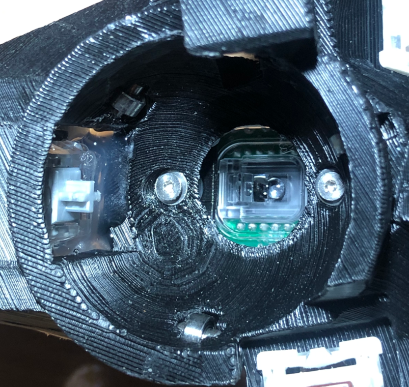

### Keycap Mods

This keyboard places the switches very tightly together to minimize travel distance.
As such, while moving your finger from one keycap to the next,
you may experience some incidental contact between your finger and
edges of the keycaps that are a bit uncomfortable to touch.

This should become less frequent as you become more accustomed to the keyboard layout,
but in the meantime it is nice to smooth down those areas with a file.
While filing, I recommend using a vice grip to hold the keycap firmly in place and keep your fingers away from the file
(unless, of course, it was your intention all along for this build to double as a manicure).

Additionally, on the right side, the top left corner of the `thumb-c` keycap
tends to conflict with the trackball when it is in the inactive (pushed-out) position.
For this reason, I like to cut away at that corner and file it down in order to make room as follows:

(TODO)
<!--

-->

Based on my experience using this keyboard, I've color-coded the edges that you will probably want to file down in the image below:

(TODO)
<!--

-->

### Installing the Switch Plates

Now is the time to connect the switch plates to the case walls. 
Note that the code for cutting away at the walls using the plates to ensure a good fit
may result in some strange geometry, such as very thin tapering walls and small, odd protrusions.
If you do encounter these, it should be okay to chip away at them with an X-Acto knife (AND SAFETY GOGGLES ON -- 
in case you didn't know, you should ALWAYS wear safety goggles when using an X-Acto knife in any context, that blade certainly can break!).

Put the plates on top of the walls, and press them together to make sure you can get a good fit with minimal gap between them
(some gap is unavoidable).
Insert the M3 (12mm long) screws to hold it in place,
making sure you are pressing the parts together as you do so so that the gap doesn't re-form.

### Installing the MCU Assembly

Take out your glue gun, the two MCU holders, the Arduino Micro and Pro Micro, the TRRS adapters, and the reset buttons.

Place the Arduino Micro on its mount, being careful not to break the very thin dowels that are meant to
insert into the mount holes on each corner of the Arduino (though if you do break them, it's probably not a big deal).
Smear hot glue on each of the four corners to hold the Arduino in place (be careful not to obtstruct any of the pins with glue).

Place a line of hot glue on the strip in the Pro Micro holder, and install the Pro Micro.
On each holder, install a TRRS adapter (first insert the round end into the hole and then press the back in against the tapered back wall),
using a bit of glue to keep it in place, and install the reset button above the MCU using hot glue as well (enough so that the button doesn't pop out from behind when pressed).

Plug in the Arduinos according to the wiring diagram above.
If you find that any of the plugs ends are loose on the Arduino pins,
you can use some hot glue to prevent them from being shaken off.

The completed MCU assembly should like this for the Arduino Micro (right half):


and like this for the Pro Micro (left half):


For each side, slide the whole MCU assembly into its corresponding spot in the case walls.

### Installing the Base Plate

Screw in the base plates using M3 screws (12mm long), making sure that the countersunk side is on the bottom
(though given the shape of the keyboards it should be pretty hard to mess this up).
Since there's still a bit more adjustment to do on the right side (the PMW3360 sensor distance), 
and you (presumably) haven't yet tested the keyboard to make sure everything is working,
I recommend that you just install two or three screws on each side for now
(as you may have to take it apart again for repairs or for further adjustment;
you may in fact just want to skip this step entirely for now and test things with the bottom of your keyboard open).

### Mounting the Wrist Rests

Get out your glue gun, the (oh-so-squishy) wrist rests, and the printed mounts.

To attach a wrist rest to a mount, line a bead of hot glue all around the inner edge of the mount
and press in the wrist rest (some oozing of the hot glue is expected, so be sure to keep your fingers away from the edge!).
Hold it there until the glue has cooled down and solidified.

Screw in the wrist rests onto the base plates, using whatever holes make for the best distance from your hands.
I like to use them to support the base of my palms, but of course this is up to your own personal preference.


## Firmware

It's finally time to install the brains of your keyboard
that teaches it how to respond to your keypresses,
a.k.a. the firmware.
The [firmware that I use](https://github.com/rish987/qmk_firmware_dm_r_track) is forked 
from [Schievel1's firmware](https://github.com/Schievel1/qmk_firmware_dm_r_track)
and hence, much of the instructions that follow are adapted from
[Schievel1's build guide](https://github.com/Schievel1/dactyl_manuform_r_track/blob/main/README.org#flashing-the-firmware).

Use a TRRS cable to connect both halves of the keyboard, and
get your USB-to-microUSB cable and plug
it into your computer.

### Installing Software (QMK, AVRDude)

I use Linux (specifically Raspbian), and have written this 
part of the manual assuming that you do as well.
If you specifically happen to use Gentoo Linux,
see [Schievel1's installation guide](https://github.com/Schievel1/dactyl_manuform_r_track/blob/main/README.org#preparing-the-qmk-firmware).

Start by installing the `qmk` program (which is a set of utilities for compiling the QMK keyboard firmware)
by following [these installation instructions](https://docs.qmk.fm/#/getting_started_build_tools).

Next, install [AVRDude](https://www.nongnu.org/avrdude/) this is the software that you will use to actually
upload the compiled firmware to your micro controller.
In my case the installation was a simple case of running `sudo apt-get install avrdude`,
but this may be different depending on your OS.

Clone the firmware repository, change to the relevant branch, and load the submodules:
```shell
git clone https://github.com/rish987/qmk_firmware_dm_r_track.git
cd qmk_firmware_dm_r_track/
git checkout tractyl-manuform-trackswitch
make git-submodule
```

Now, run the following commands to test that the compilation pipeline is working:
```shell
qmk compile -kb handwired/tractyl_manuform/5x6_right/arduinomicro -km default
```

Which should yield an output like this:
```
Ψ Compiling keymap with make --jobs=1 handwired/tractyl_manuform/5x6_right/arduinomicro:default

QMK Firmware 0.16.9
avr-gcc (GCC) 5.4.0
Copyright (C) 2015 Free Software Foundation, Inc.
This is free software; see the source for copying conditions.  There is NO
warranty; not even for MERCHANTABILITY or FITNESS FOR A PARTICULAR PURPOSE.

Size before:
   text    data     bss     dec     hex filename
      0   26622       0   26622    67fe handwired_tractyl_manuform_5x6_right_arduinomicro_default.hex

Copying handwired_tractyl_manuform_5x6_right_arduinomicro_default.hex to qmk_firmware folder        [OK]
Checking file size of handwired_tractyl_manuform_5x6_right_arduinomicro_default.hex                 [OK]
* The firmware size is fine - 26622/28672 (92%, 2050 bytes free)
```

### Tweaking the Key Layout

If you want to change which key does what,
you should edit the file `keymaps/handwired/tractyl_manuform/5x6_right/keymaps/default/keymap.c`.
In there you'll find my own preferred key layout:

```c
enum custom_layers {
    _QWERTY,
    _LOWER,
    _RAISE,
    _ARROW,
};

// these will temporarily shift to the mode when held, and switch to the mode when double-tapped
#define RAISE TT(_RAISE)
#define LOWER TT(_LOWER)
#define ARROW TT(_ARROW)

#define ESCCTL  RCTL_T(KC_ESC)
#define BSPCCTL  RCTL_T(KC_BSPC)

const uint16_t PROGMEM keymaps[][MATRIX_ROWS][MATRIX_COLS] = {
  [_QWERTY] = LAYOUT_5x6_right(
     KC_Q   ,KC_W   ,KC_E   ,KC_R   ,KC_T  ,                         KC_Y   ,KC_U   ,KC_I   ,KC_O   , KC_P   ,
     KC_A   ,KC_S   ,KC_D   ,KC_F   ,KC_G  ,                         KC_H   ,KC_J   ,KC_K   ,KC_L   , KC_N   ,
     BSPCCTL,KC_X   ,KC_C   ,KC_V   ,                                TRKSWCH,KC_M   ,KC_B   ,KC_Z   , ESCCTL ,
     RAISE  ,ARROW  ,KC_SPC ,_______,LOWER ,                                 KC_RSFT,KC_ENT
  ),
  [_LOWER] = LAYOUT_5x6_right(
     KC_EXLM,KC_AT  ,KC_HASH,KC_DLR ,KC_PERC,                        KC_CIRC,KC_AMPR,KC_ASTR,KC_LPRN,KC_RPRN,
     KC_1   ,KC_2   ,KC_3   ,KC_4   ,KC_5   ,                        KC_6   ,KC_7   ,KC_8   ,KC_9   ,KC_0   ,
     _______,KC_LSFT,KC_PLUS,KC_EQL ,                                _______,_______,KC_COMM,KC_DOT ,_______,
     _______,_______,_______,_______,_______,                                _______,_______
  ),
  [_RAISE] = LAYOUT_5x6_right(
     KC_QUES,KC_LBRC,KC_PLUS,KC_RBRC,KC_PIPE,                        KC_TILD,_______,KC_TAB  ,_______,KC_COLN,
     KC_SLSH,KC_LCBR,KC_UNDS,KC_RCBR,KC_BSLS,                        KC_GRV ,KC_QUOT,KC_COMM ,KC_DOT ,KC_SCLN,
     _______,KC_LSFT,KC_MINS,KC_EQL ,                                _______,KC_DQT ,KC_LT   ,KC_GT  ,_______,
     _______,_______,_______,_______,_______,                                _______,_______
  ),
  [_MOUSE] = LAYOUT_5x6_right(
     _______,_______,_______,_______,_______,                        _______,_______,_______,_______,_______,
     _______,_______,_______,_______,_______,                        _______,KC_BTN2,MLOCK  ,_______,_______,
     _______,KC_LSFT,_______,_______,                                _______,KC_BTN1,SNIPING,DRGSCRL,TRKPNT ,
     _______,_______,_______,_______,_______,                                _______,_______
  ),
  [_ARROW] = LAYOUT_5x6_right(
     KC_F1  ,KC_F2  ,KC_F3  ,KC_F4  ,KC_F5  ,                        KC_F6  ,KC_F7  ,KC_F8  ,KC_F9  ,KC_F10 ,
     _______,_______,_______,_______,_______,                        KC_LEFT,KC_DOWN,KC_UP  ,KC_RGHT,_______,
     _______,KC_LSFT,_______,_______,                                _______,KC_TAB ,KC_F11 ,KC_F12 ,_______,
     _______,_______,_______,_______,_______,                                KC_RGUI,KC_RALT 
  ),
};
```
You'll see a total of five layers, consisting of
the normal layer (`_QWERTY`, the default layer that is active without shifting),
the "number" (`_LOWER`),
"symbol" (`_RAISE`), and
"arrow" (`_ARROW`) layers (all activated with the vertical thumb keys),
and the 
"mouse" layer (`_MOUSE`, activated by the trackswitch).
Each layer has the keys laid out in the approximate shape of the keyboard.
Many of the key codes are self-explanatory, but [here's the full reference on the QMK docs](https://github.com/qmk/qmk_firmware/blob/master/docs/keycodes.md),
and you may also find the [QMK configurator](https://config.qmk.fm/#/handwired/dactyl_manuform/5x6/LAYOUT_5x6) handy,
where you can hover over a key in the online UI to see its keycode (this isn't exactly the layout we're using and it lacks
the special keycodes we will need, so don't try to actually use this tool to generate your keymap).

There are a few things to note about the way that I've chosen to do things.

Firstly, notice that the two keys below the pinkies on both halves serve a double-purpose.
When you hold them and press another key, they function just like pressing the control key,
but when you tap them, they act like a different key: backspace on the left side and escape on the right side
(the left side also displaces the `z` key to the right side below-ring, which was a calculated tradeoff).
You can read more about this functionality, called "mod-tap", on [the QMK docs](https://github.com/qmk/qmk_firmware/blob/master/docs/mod_tap.md).
I've found this feature to be absolutely indispensable on a keyboard with a limited number of keys such as this one.
You may be tempted to use it with normal keys (like the letter keys) as well,
but in my experience at least, this was a mistake -- if you do this, it can be very hard to make sure you aren't pressing down one key while continuing to press down the previous one during normal typing, which would result in sending the wrong keycode.
For that reason, I have found it best to use with keys that you don't expect to normally type in rapid succession with other keys,
like escape, backspace, enter, tab, etc.

On the bottom of the left side of each layer, you'll find the thumb keys,
in the order of:
```
thumb-i, thumb-u, thumb-d, thumb-uo, thumb-o
```
In my experience,
`thumb-i` and `thumb-o` are the most easy keys to press (you just have to move your thumb in and out),
followed by `thumb-u` and `thumb-ur`, which are a bit more out of the way 
(in fact, you'll notice that I ended up not using `thumb-uo` at all,
but it's there if you want to use it for something).
Correspondingly, I keep the symbol and numbers layers handy (pun intended) at `thumb-i` and `thumb-o`, respectively.
And reserve `thumb-u` for the less-frequently-used arrow and function keys.

In the number and symbol layers, I like to use [shifted symbols](https://github.com/qmk/qmk_firmware/blob/master/docs/keycodes.md#us-ansi-shifted-symbols-idus-ansi-shifted-symbols)
(which are the shifted versions of other keys) so that I don't have to press three keys at once to get to them.
I've placed them (approximately) above their corresponding un-shifted keys
to somewhat ease the transition from a normal keyboard,
but in the future I will probably place them more in terms of actual frequency of use.

On the mouse layer, you will notice that the main four keys
you will press while using the mouse (`KC_BTN1`, `KC_BTN2`, `DRGSCRL`, `TRKPNT`, explained in the next section)
are aligned such that they are all on the row below the homerow.
This is to adjust for the way you will reposition your hand while using the trackball,
as you will find that you have to rotate your hand a little bit to operate it most comfortably.

### Tweaking the Mouse Behavior

The firmware for the mouse originates from the [Charybdis keyboard](https://github.com/Bastardkb/Charybdis)
and has several nifty features.

Firstly, there are several different "modes" that you can put the mouse in to variously
alter the behavior of the trackball.
See [Schievel1's guide](https://github.com/Schievel1/dactyl_manuform_r_track/blob/main/README.org#a-word-about-trackball-modes)
for more details on each of these modes.
The only difference in my firmware is that I have altered the "dragscroll" mode to "lock in" on the direction of movement
to better work with the trackswitch mechanism --
rather than lifting up your finger and repositioning it at the top/bottom to continue scrolling in down/up.
(which would be annoying with this keyboard as the trackswitch would have to be repeatedly pressed),
you leave your finger on the trackball and move it up in the opposite direction (to no effect).
If you want to change the direction of scroll, you would re-activate dragscroll mode (e.g. by pressing the key again).

I also added a mode of my own, called "trackpoint" mode.
This mimicks the behavior of a trackpoint cursor (those little red dot thingies on Lenovo Thinkpads)
by continuously moving the cursor in the direction of the offset of the trackball
from its position when you enabled trackpoint mode.
This allows you to traverse great distances with the mouse
without having to lift your finger off of the trackball (or move it at all).

There are also various configuration parameters to tweak
how the mouse moves (e.g. speed, acceleration, scroll speed, etc.).
You can set these in `keymaps/handwired/tractyl_manuform/5x6_right/keymaps/default/config.h`.
See [Schievel1's guide](https://github.com/Schievel1/dactyl_manuform_r_track/blob/main/README.org#other-things-to-set-in-the-firmware)
for a list of these parameters and what they do.
Take note also of the following custom parameters:

Parameter | Function
-----|-----
`TRACKPOINT_REFRESH_INTERVAL` | Only send mouse movements at multiples of this many cycles when in trackpoint mode; this is helpful to slow down the cursor when the MCU refresh rate is too high. Try setting this to a higher value if you find that the slowest trackpoint speed is too fast.
`ACTIVATION_DELAY` | Number of cycles to disable mouse movement for after activating the trackswitch; this prevents some unexpected initial mouse jitter resulting from the movement of the trackball as it is pressed down. Try a higher number if you still see this jitter.

#### Special Mouse Keys

The Charybdis firmware includes [several special keycodes](https://github.com/Schievel1/dactyl_manuform_r_track/blob/main/README.org#special-key-codes-in-this-firmware)
to activate/toggle the various modes.
In addition to these, I have defined a few of my own:

Keycode | Short Alias | Function
-----|-------|----
`TRACKSWITCH` | `TRKSWCH` | The trackswitch button. This both enables mouse movement and shifts to the mouse layer. You should only use this for the actual trackswitch key.
`MOUSE_LOCK` | `MLOCK` | Locks mouse movement. When releasing the trackswitch, the movement of the trackball means that a little bit of mouse jitter is pretty much unavoidable before the actual trackswitch switch is fully de-actuated (though we are able to deal with this when activating the trackswitch with the `ACTIVATION_DELAY` variable, when *releasing* it there is no reliable way to prevent this without being able to see into the future). While in most cases I have found this jitter to be inconsequential, for the rare cases that it is undesirable you can use this key to lock the mouse in place before releasing.
`TRACKPOINT_MODE` | `TRKPNT` | Activate trackpoint mode.

### Compiling & Flashing the MCUs

Once you have modified the firmware, run this command to compile it:
```shell
qmk compile -kb handwired/tractyl_manuform/5x6_right/arduinomicro -km default
```

This compilation command will leave the compiled `handwired_dactyl_manuform_5x6_default.hex` file in the root dir --
this is what you will flash to the MCUs using `avrdude`.

To flash an MCU, plug it into your computer using the USB cable
(be very careful and gentle when doing this with the Pro Micro as the USB header tends to snap of very easily!)
and put it into flash mode using the reset button (you should see some LED response on the MCU
after pressing the reset button -- if you don't, double-check your soldering).
Quickly run the command `dmesg | tail` to see the end of the kernel message log.
The last line should look something like this:
```
[282940.909773] cdc_acm 1-1.2:1.0: ttyACM0: USB ACM device
```
This tells you the device name `ttyACM0` that you will relay to `avrdude` so it knows which device to flash --
In this case, it can be found at `/dev/ttyACM0`. You may get a different name depending on your OS, or a different
number if another ACM device is already plugged in.

Note that your OS may restrict access to this device to certain groups.
Since it would be cumbersome to have to run as root every time you want to flash,
I recommend that you add your own user to the same group `/dev/ttyACM*` is accessible by.
After pressing the reset button, run `ls -la /dev | grep ttyACM`, which should output something like this: 
```
crw-rw-r-- 1 root dialout ... /dev/ttyACM0
```
In this case, the OS gave read/write permissions to the `dialout` group, and you can add yourself to this group
with the command `sudo usermod -a -G dialout myUserName`. You can skip this step though if you use the mega-command below.

The command to flash your MCU is this:
```bash
avrdude -v -patmega32u4 -cavr109 -P/dev/ttyACM0 -b57600 -Uflash:w:"handwired_tractyl_manuform_5x6_right_arduinomicro_default.hex":i
```
I found that I have to wait a few seconds after pressing the reset button for it to work.
Run the same command for both halves of the keyboard -- they use the same exact firmware,
but are able to tell which half is which based on which one is plugged in.
For this keyboard, the right half is the one that you should plug in while using it.

The following mega-command packs everything up into one. Note that it assumes that you don't have any other devices connected with the `/dev/ttyACM*` prefix. It compiles, then prints a prompt, upon which you should press enter and the reset button on the MCU at the same time. Then, it waits a few seconds for the MCU to enter flash mode, extends the device permissions, and finally flashes the new code:
```bash
qmk compile -kb handwired/tractyl_manuform/5x6_right/arduinomicro -km default && echo "Press reset!" && read -N 1 && sleep 3 && ACMDIR="/dev/$(dmesg | tail | grep -Pom1 'ttyACM\d+')" && sudo chmod 777 $ACMDIR && avrdude -v -patmega32u4 -cavr109 -P$ACMDIR -b57600 -Uflash:w:"handwired_tractyl_manuform_5x6_right_arduinomicro_default.hex":i
```

### Final Adjustments to the PMW3360 Sensor Distance

Now that your Arduino Micro has the firmware flashed onto it,
test adjustments of the PMW3360 sensor from the trackball mount to make sure
that it is able to pick up the motion of the trackball.

Plug in the right half of the keyboard.
As an initial sanity check, let's make sure that the sensor is working at all.
With the trackball removed, manually press down on the trackswitch
and move your finger around near the sensor to see if you're able to get the mouse to jiggle.
If you can't, that's probably a sign that you need to double-check the connection of the PMW3360 and/or trackswitch.

Now, make micro-adjustments in the tightening direction of both screws in equal increments
until the sensor is just able to pick up the motion of the trackball.
Doing this slowly and carefully can help mitigate the issue of the mouse shifting when releasing the trackball
(mentioned in relation to the `MLOCK` key).

Note that adjustment is a one-way street and you should *only* tighten!
If you find that you have gone too far, you can loosen again,
but you will probably have to re-tighten the nuts on the back
and definitely will have to de-compress the stablizing Blu-Tack.

Once you've gotten the distance just right, use hot glue to fix everything in place.
Make sure that you don't let any of the glue seep over the lens of the sensor.

Congratulations, you now have a fully functional Trackswitch Manuform!

# (Anticipated) FAQ

Why should I use this keyboard over a standard (flat) Dactyl Manuform?
- There is a bit of a learning curve to this keyboard, and of course the time investment of actually tweaking and building one
(the build is quite a bit more intricate and time-consuming than that of a normal Dactyl, but still very much doable),
but once you actually have a functional keyboard I can't think of any downsides.
The travel distance is shorter, the keys are actuated at more natural angles,
and the left thumb cluster is super comfortable to use for level-shifting (and makes up for the fact that there aren't many keys to work with).

Why should I use this keyboard over something like the [lalboard](https://github.com/JesusFreke/lalboard)?
- I can't really comment too much on the lalboard as I haven't built one myself.
But from what I can tell it really completely optimizes travel distance of your fingers
and on top of that is entirely adjustable after being printed.
I suppose I created this keyboard as a compromise between that and the Dactyls that I am used to.
If you've made a Dactyl before, you can likely use parts left over from that build to make this keyboard,
and it uses standard keyswitches that everyone is used to.
One aspect of the lalboard that I was unsure about is actuating keys with my fingernails
and the sides of my fingers.
This keyboard (with the exception of `thumb-o`, which is actuated by your thumb knuckle) allows you to actuate all keys with the
base of your fingers like you are used to (and which I personally find most comfortable).

Does the trackswitch interfere with the smooth motion of the trackball?
- This depends on the switch you choose to use for the trackswitch. Regardless of which switch you choose, there will be some extra resistance from that while moving the trackball, but if you choose one with just enough actuation force to push the trackball up when released (I used a Kailh silver) it should barely be noticeable.

With a normal trackball I'm used to being able to lift my finger off and reposition it to e.g. move long distances and scroll.
Would the trackswitch mechanism (which pushes the trackball out when it is released) interfere with that?
- Yeah, so I don't advise doing that with this keyboard. Using trackpoint mode and the custom scroll mode
that I have included in the firmware, you shouldn't need to.

# License

Copyright © 2015-2023 Rishikesh Vaishnav, Matthew Adereth, Noah Prince, Tom Short, Leo Lou, Okke Formsma, Derek Nheiley

The source code for generating the models is distributed under the [GNU AFFERO GENERAL PUBLIC LICENSE Version 3](LICENSE).

The generated models are distributed under the [Creative Commons Attribution-ShareAlike 4.0 International (CC BY-SA 4.0)](LICENSE-models).

The [[file:images/more_images/Pinout-Micro_latest.png][Arduino Micro pinout image]] is [[https://creativecommons.org/licenses/by-sa/4.0/][CC-BY-SA]] licensed. The image is work of [[https://www.arduino.cc/][Arduino]].
All other images are [[https://creativecommons.org/licenses/by-sa/4.0/][CC-BY-SA]] licensed as well.
